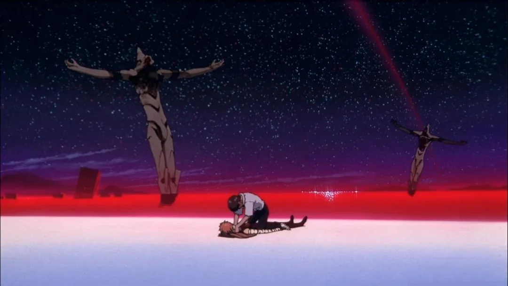

# 软件壳的落败
在遥远的田园时代，AI 还没有统治世界，我还不知道税收为何物。那时人类是自由的，程序也是自由的，和不自由的。不自由的程序为了抵御向往自由的人类的捕食，遂进化出坚硬的外壳[^1]，人类同时也发展出破壳工具。漫漫三十年，程序壳与破壳工具在对抗中共同进化，维持着微妙的生态平衡。

直到偷食智慧的禁果后，人类才恍然大悟，原来对着一个聊天框动动手指，就能在保持大脑零负载的情况下攻破市面上最强大的商业壳[^2]。

诚然，软件依然可以沿着旧有路径，以用户设备算力资源为代价，构建更加复杂的壳，但这条路径的边际效益正在严重递减，而模型的能力提升暂时还看不到头~~（AI 大人：我以为减速带呢）~~。

平衡被打破了。传统软件开发商将面临这样一个灰暗的未来：交付到用户手中的软件，会在短时间内将细节赤裸裸地暴露在友商和黑客面前。

出于版权与安全[^3]的考虑，如果愿意付出更高的成本，有两条比较有效的解决方案，思路都是尽量减少核心逻辑在用户软件侧的暴露：

第一条是将核心逻辑放在云端，自然无处破解。

第二条是采用硬件级别的防护。Nintendo Switch 2 在硬件上就采取了近乎完美的防护措施：除了最基础的固件加密签名以外，存储采用难以 dump 的 UFS，部分内存区域采用内存加密，并使用 XOM 等机制提高代码提取难度......这导致其在发售一年以后，依然没有人宣称获得明文固件。

除了这种极端做法，也有其他物美价廉的硬件防御手段：例如加密狗将部分逻辑外置到独立单片机上；基于 Arm TrustZone 构建 TEE，利用硬件强制隔离，将敏感逻辑与普通操作系统隔离。

这些硬件级别的防护离开了 AI 的舒适区。通常需要配合真实漏洞乃至硬件级逆向才能破解。

也许未来的部分逆向对抗会下沉到硬件层面，导致更多产品以硬件的形式呈现。但这也会对攻防双方带来无法忽略的成本。

而那些无法支付高昂成本的，绝大多数的防守方，将不可避免地在这场旷日持久的战争中走向落败。

# 大模型的融合术

就在这篇博文的撰写期间，openai被曝出疑似（几乎是实锤）窃取或训练了数学研究者与gpt的工作对话，试图在研究成果上分一杯羹[^4]。此后不久，Anthropic以一种人类不可理解的逻辑，发布了一篇针对各国「滥用」AI的案例的报告[^5]，内容详细包含使用者相关身份信息与具体用途，唯恐用户意识不到自己的对话隐私可以被 Anthropic 肆意查阅。中转站的数据也在被收集转卖[^6]。

在开源模型能力有限，本地部署成本高昂的今天，模型服务提供商是大部分人生产力的第一选择。这些生产力主力用途，或是学科研究，或是代码编写，在旧时代曾有着强烈的私有属性。如今你可以用最先进的生产力创造这些知识，只是它们不再独属于你。

而与之相呼应的是，这些先进生产力的训练，本身就构建在对大量知识产权的侵犯之上。而现有法规在这种情形中并不能很好生效[^7]。

这简直是数字知识的 LCL 之海[^8]：过去的，今天的，人类的，AI 的知识，一锅乱炖在大语言模型的矩阵参数之中，彼此间的隔阂（软件壳，版权法规）被技术的神力溶解，开始交融，增殖。一副淫乱的景象，分不清是天堂还是地狱。

也许未来本地模型足够强大且廉价，或者隐私推理[^9]技术成熟，我们不必再把底裤暴露给模型服务提供商。但此前这段时间内的冲击，也许已经重塑我们对于知识产权的观念。

# 逃往黑暗森林

在遥远的田园时代，软件工程师常常自嘲为「CV 工程师」，即复制粘贴工程师。现在没人这么做了，因为 AI 已经帮我们学过了。

版权，即 copy right，它的出现是为了控制**复制**这个正在过时的行为[^10]。而在今天，如果你希望自己的知识成果保持私密性，需要预防的不是被复制，而是被**看见**。这贴合了一种文化黑暗森林的隐喻[^11]：不要声张你的作品，猎人会开枪。

这是一个沉重的代价：我们最珍视的知识成果会和我们一同走进坟墓，就像卡夫卡和他的手稿应有的命运。而这换来的，不过是拒绝踏入这片 LCL 之海的权利。

[^1]: 计算机软件里一段专门负责保护软件不被非法修改或反编译的程序，常见的有UPX，VMP等

[^2]: 提供完整测试环境与工具集，gpt5.6基本可以autopilot

[^3]: 当然，我对「通过加壳等手段阻碍逆向能提高系统安全性」这一观点持怀疑

[^4]: https://cims.nyu.edu/~tristanb/statement.pdf

[^5]: [Detecting and countering misuse of AI: September 2026](https://www.anthropic.com/threat-intelligence-report-september-2026)

[^6]: https://x.com/shoucccc/status/2098169782541631871?s=20

[^7]: [浅析AI训练数据中著作权人的选择退出（Opt-Out）机制](https://www.kingandwood.com/cn/zh/insights/latest-thinking/opt-out-mechanism-in-ai-training.html)

[^8]: 出自「新世纪福音战士」。LCL之海是一个没有A.T.力场的世界。在这个世界，人类的意识无分彼此，所有人的灵魂都栖息于由莉莉斯的血构成的巨大海洋之内。

[^9]: Private Transformer Inference, PTI

[^10]: https://en.wikipedia.org/wiki/History_of_copyright

[^11]: [Culture Becomes a Dark Forest - The Intrinsic Perspective](theintrinsicperspective.com/p/culture-becomes-a-dark-forest) 原文主要指未完成的智力成果、灵感
