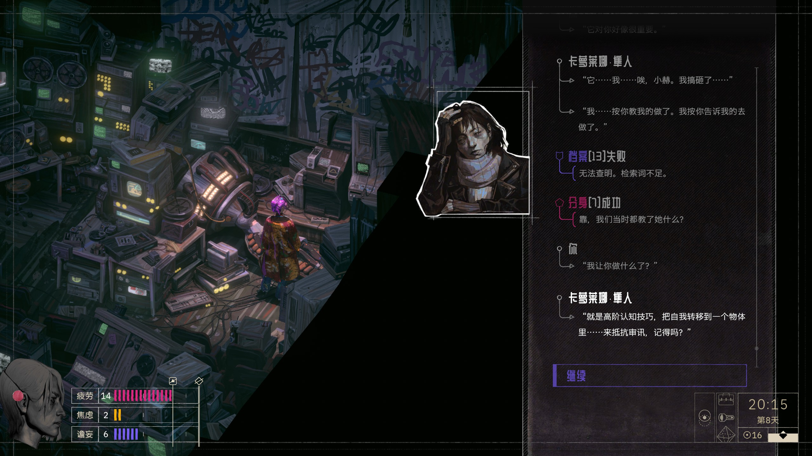

> 剧透预警！
> 部分内容受限于记忆或未触发的情节，可能出现偏差？！

早早听说了 ZA/UM 团队主创离开的消息[^1]，很遗憾再也没有机会玩到《极乐迪斯科》这样的作品了。于是新作《归零巡礼》发售后，我并没有多少期待，以为不过是庸人的仿品罢了。

玩了一段时间后，第一反应是：太像了。从文本风格到画面风格，都让我确信这就是《极乐迪斯科》。随后世界的图景徐徐展开，地缘政治、文化封锁、刻印体，一系列极富野心的概念出现，扣人心弦。

失望发生在我试图寻找一个「真结局」的时候。我意犹未尽，相信这个平淡的结局并没有把故事讲完，我期待看到那些前文中富有野心的概念能得到认真诠释。然而「真结局」终归是不存在的。飞流的选择只是能让不同的队友用不同的姿势去送死，最后像模范小学生一样，向老师索取一个带分数的成绩鉴定。

游戏中遇到的第一个概念是「归零（zero out）」。飞流醒来时，看到原定的队友——伪足穿着红裤衩瘫倒在办公椅上，目光呆滞，失去一切意识。她在报告情况时，第一次使用了「归零」这个不明觉厉的词。「归零」作为游戏标题的一部分，很自然的推测是：某种意识清除的手段，由剧院对派出的行动员进行计划性的使用，可能是出于保护某些真相的目的。

直到游戏结局，用枪干掉两个大巫妖后，游戏会弹出成就：「归零大巫妖」。这时我才明白，「归零」就是「干掉」的替换词。干掉伪足的也并非某个更大的幕后黑手，只是一个间谍同行罢了。

另一个概念是游戏中无处不在的阴谋论，这一点沿袭了一代的风格。我也很喜欢加点这些神神叨叨的思维，逢人便开始传教，享受被当成神经病的快感。游戏中主要的阴谋论都由袋头男和全新世提供。袋头男像一个幕后的全知者，他说世界是虚假的，时间是不存在的。此外他还能探知玩家脑中的思考，甚至意识到玩家有读档的能力（对话后能获得一个禁用手动存档功能的思维）。全新世感知到了头脑中存在一个用于监听的小操控员——一只小金丝猴，并让飞流做手术取了出来。

这就是「真相」的全部了，随后的情节中再也没有出现过相关内容。我们的王牌特工飞流来到演播厅和「全知」的袋头男对质，问了几个「野猪曾经被用作保安」之类不痛不痒的问题，然后就放人走了。此后再也查无此人。甚至飞流从昔日队友的脑子里抠出一只金丝猴，也只是表达震惊，这事就算过去了。此时屏幕外的我恨不得把每个人的脑子都打开抠一遍，看看里面是不是也有一只金丝猴。

最终刺杀大巫妖的时机，被那个沉迷色情热线的男子称为「神圣间隙」、「秘密仪式」。飞流和女公爵使用某种精神分析（？）的手段在男子的潜意识中找到了这片间隙，花了大量篇幅，描述得相当玄乎。最后谜底揭晓：大巫妖的日程安排中间有个空，要去参拜法西斯神社，就这样。

可以理解，编剧太想让《归零巡礼》成为《极乐迪斯科》了，因而不得不造出许多像《极乐迪斯科》中「灰域」、「伊苏林迪竹节虫」这样宏大的概念来满足玩家的胃口。但结果是，许多概念只是一个空壳，这些高开低走的概念，有的成了语言上的腐败，有的留下没讲完的故事。

尽管有诸多缺陷，我依然喜欢这款游戏。卡萝莱娜回忆中的高阶认知技巧，文化宫里的胡子幽灵，播放着《梦中的你》瞬消碟的夺命云轨列车，都是令人难忘的设计。从游戏性上说，这是一款比《极乐迪斯科》更加成熟的游戏。天才的灵感可遇而不可求，所以仿品也有属于自己的使命。这一点《归零巡礼》已经完成了。

[^1]: [《极乐迪斯科》主创起诉开发商 ZA/UM](https://www.ign.com.cn/disco-elysium/41296/news/ji-le-di-si-ke-zhu-chuang-qi-su-kai-fa-shang-zaum)
