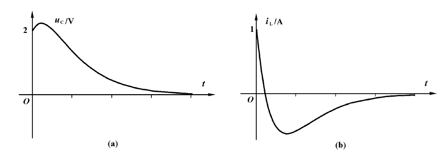
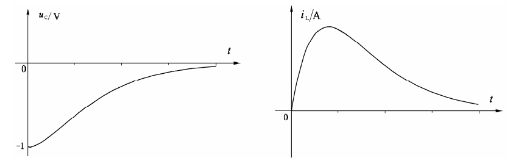
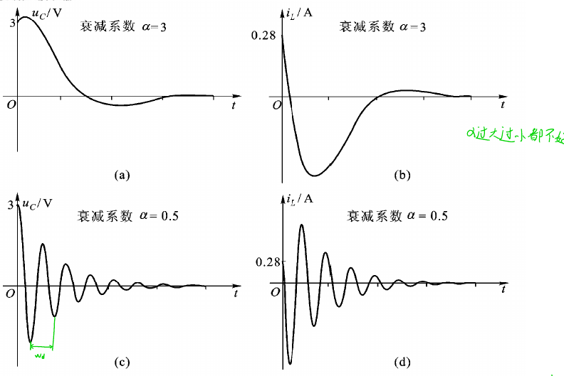
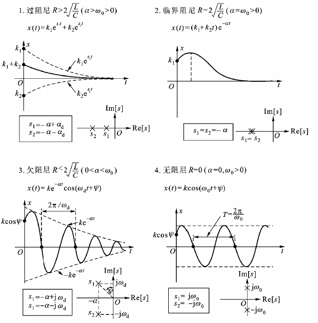

> $V_D$表大DC，$v_D$表全信号，$v_d$表小AC
>
> 热电压常数$V_T=\frac{k}{q}T$在常温(27度)默认为26mV
>
> $V_S$域值电压	$V_{TH}$为BJT重要参数

# 电容&电感

## 电容

### 模型

$$
q=CU
$$

$$
i(t)=\frac{dq}{dt}=C\frac{du}{dt}
$$

$$
u_c(t)=\frac{1}{C}\int_{-\infty}^0i(\xi)d\xi+\frac{1}{C}\int^t_0i(\xi)d\xi
$$

### 电压的记忆性

峰值检测器电路

### 电压的连续性

电容电流**有界**时，电压不能突变

### 储能

$$
p(t)=u(t)C\frac{du}{dt}
$$

$$
W(t_0,t)=\int_{t_0}^tp(\xi)d\xi=\frac{1}{2}C[u^2(t)-u^2(t_0)]
$$

若初始储能为0，则任意时刻能量：
$$
W(t)=\frac{1}{2}Cu^2(t)
$$
某时刻电容储能只取决于**电压**，与电流无关

### 串并联

并联变大，串联变小

## 电感

### 模型

$$
\psi =Li
$$

$$
u(t)=\frac{d\psi}{dt}=L\frac{di}{dt}
$$

$$
i(t)=\frac{1}{L}\int_{-\infty}^0u(\xi)d\xi+\frac{1}{L}\int_0^tu(\xi)d\xi
$$

### 电流的记忆性

### 电流的连续性

### 储能

$$
p(t)=i(t)L\frac{di}{dt}
$$

$$
w(t_0,t)=\frac{1}{2}L[i^2(t)-i^2(t_0)]
$$

某时刻电容储能只取决于**电流**，与电感无关

### 串并联

并联变小，串联变大

# 一阶电路的暂态过程

## 全响应-三要素法（仅限直流激励一阶）

$$
f(t)=[f(0_+)-f(\infty)]e^{-\frac{t}{\tau}}+f(\infty)\space (t\geq0)
$$

> 全响应 = 固有响应（瞬态响应） + 强制响应（稳态响应）
>
> 注意：**非直流激励**下，固有响应**不等于**瞬态响应，稳态响应**不等于**稳态响应
>
> 瞬态响应：随t变化	固有响应：由内部电路原本状态引起的变化

$$
f(t)=f(0_+)e^{-\frac{t}{\tau}}+f(\infty)(1-e^{-\frac{t}{\tau}})\space(t\geq 0)
$$

> 全响应 = 零输入响应 + 零状态响应

$$
\tau=R_0C\space or\space\tau=\frac{L}{R_0}
$$

$\tau$ 具有时间但量纲，称为RC电路的**时间常数**

一般用$3\tau$ 法判断放电过程结束，即90%

计算R时，电容用**戴维宁等效**，电感用**诺顿等效**

### :warning:注意

电容电路里，电流**可以跃变**；电感电路里，电压**可以跃变**

注意表达式范围是否包含0

## 包含开关序列的直流一阶电路

### 阶跃函数

$$
\varepsilon(t)=\begin{cases}
0 & t<0\\\\
1 & t>0
\end{cases}
$$

引入阶跃电流源和阶跃电压源可以省去电路中的开关，可以应用叠加定理计算电路的零状态响应

### 阶跃响应

单位阶跃信号作用下电路的**零状态响应**，用$s(t)$表示

已知电路的阶跃响应，利用**叠加定理**易得任意分段恒定信号激励下线性时不变电路的零状态响应

### 冲激函数

一个无界信号$\delta(t)$为**单位冲激函数**当且仅当
$$
\begin{cases}
\delta(t)=\begin{cases}
		奇异值&t=0\\\\
		0&t\neq 0
	\end{cases}\\\\
	\int_{-\varepsilon_2}^{\varepsilon_1}\delta(t)dt=1&\varepsilon_1>0,\varepsilon_2>0
\end{cases}
$$
单位阶跃函数与单位冲激函数间存在关系
$$
\delta(t)=\frac{d\varepsilon(t)}{dt}
$$

$$
\varepsilon(t)=\int^t_{-\infty}\delta(\xi)d\xi
$$

### 冲激响应

单位冲激信号作用下电路的**零状态响应**，表示为$h(t)$

可先求出$s(t)$，对时间求导

# 二阶电路的暂态过程

> 仅讨论含两个动态原件的线性二阶电路

## RLC串联电路的零输入响应

常系数非齐次线性二阶微分方程:
$$
LC\frac{d^2u_c}{dt^2}+RC\frac{du_c}{dt}+u_c=u_s(t)
$$
电路微分方程的特征根（电路的**固有频率**）:
$$
s_{1,2}=-\frac{R}{2L}\pm\sqrt{(\frac{R}{2L})^2-\frac{1}{LC}}
$$

1. $R>2\sqrt{\frac{L}{C}}$ ，$s_{1,2}$为不相等实根，**过阻尼情况**
2. $R=2\sqrt{\frac{L}{C}}$ ，$s_{1,2}$为相等实根，**临界阻尼情况**
3. $R<2\sqrt{\frac{L}{C}}$ ，$s_{1,2}$共轭复数根，**欠阻尼情况**

> 对R来说，越大越不易震荡，R趋近$\infty$时开路；越小越易震荡，R为0时为LC震荡电路
>
> L越大（L储能越大，$\frac{1}{2}L\Delta i^2$大，电流变化大）C越小（$q=CU$电压变化越大），越容易震荡

### 过阻尼

### 临界阻尼

### 欠阻尼

$$
s_{1,2}=-\frac{R}{2L}\pm\sqrt{(\frac{R}{2L})^2-\frac{1}{LC}}=-\alpha\pm j\sqrt{w_0^2-\alpha^2}=-\alpha\pm jw_d
$$

衰减因子$\alpha=\frac{R}{2L}$，因为RCL串联电路震荡快慢由i决定，故用电感时间常数，等于$\frac{1}{2\tau}$

无阻尼自然（谐振）频率$w_0=\frac{1}{\sqrt{LC}}$

有阻尼自然频率$w_d=\sqrt{w_0^2-\alpha^2}$

欠阻尼能量在**电容与电感**之间交换

### 直流激励下RLC串联电路的响应

全响应由对应齐次微分方程通解与微分方程特解之和组成
$$
u_c(t)=u_{Ch}(t)+u_{Cp}(t)
$$
 $s_1\neq s_2$时
$$
u_c(t)=K_1e^{s_1t}+K_2e^{s_2t}+U_S
$$
利用
$$
u_c(0),\frac{du_c(t)}{dt}\Bigg |_{t=0}=\frac{i_L(0)}{C}
$$
求解$K_1K_2$

## RLC并联电路的零输入响应

$$
LC\frac{d^2i_L}{dt^2}+GL\frac{di_L}{dt}+i_L=i_s(t)
$$

$$
s_{1,2}=-\frac{R}{2L}\pm\sqrt{(\frac{R}{2L})^2-\frac{1}{LC}}
$$

$$
s_{1,2}=-\frac{G}{2C}\pm\sqrt{(\frac{G}{2C})^2-\frac{1}{LC}}=-\alpha\pm j\sqrt{w_0^2-\alpha^2}=-\alpha\pm jw_d
$$

衰减因子$\alpha=\frac{G}{2C}$，因为RCL并联电路震荡快慢由u决定，故用电容时间常数，等于$\frac{1}{2\tau}$

无阻尼自然（谐振）频率$w_0=\frac{1}{\sqrt{LC}}$

有阻尼自然频率$w_d=\sqrt{w_0^2-\alpha^2}$

