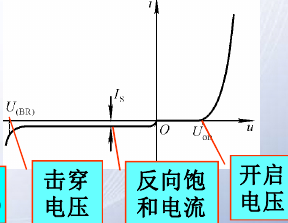
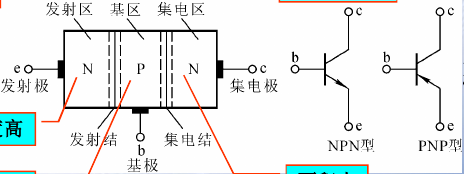
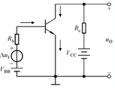
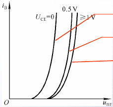
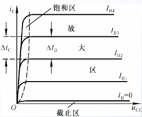

> 模电我真的好喜欢你啊啊啊:heart_eyes:

# 二极管

$$
i=I_s(e^{\frac{u}{U_T}}-1),常温下U_T=26mV
$$

## 等效电路

**大信号模型：**

- 理想二极管
- 理想二极管串一个反向的$U_{ON}$电压源

**小信号模型（静态点附近）：**

- 动态电阻$r_d=\frac{\Delta u_D}{\Delta i_D}\approx\frac{U_T}{I_D}$

## 主要参数

- 最大整流电流$I_F$：平均
- 最大反向工作电压$U_R$：瞬时

- 反向电流$I_R(I_S)$ 

- 最高工作频率$f_M$：PN结有电容效应

## 稳压二极管

dddd

# 晶体三极管Triode

:cry:

## 结构

## 放大作用

### 放大条件

1. $U_{BE}>U_{on}$，发射结正偏
1. $U_{CB}\geq0$，即$U_{CE}\geq U_{BE}$，集电结反偏

### 电流分配

$$
I_E=I_B+I_C
$$
共射电流放大系数：
$$
\beta\approx\frac{I_C}{I_B}
$$
共基极电流放大系数：
$$
\alpha=\frac{I_C}{I_E}
$$

## 输入输出特性

### 输入特性

$$
i_B=f(u_{BE})\Big |_{U_{CE}}
$$

## 输出特性

### 截止区

$$
u_{BE}<U_{on},u_{BC}<U_{on}
$$

### 放大区

$$
u_{BE}\geq U_{on},u_{BC}<U_{on}
$$

$$
i_C=\beta i_B,\Delta i_C=\beta\Delta i_B
$$

输出回路电流$i_C$几乎仅仅取决于输入回路电流$i_B$，可等效为**受控电流源**

### 饱和区

$$
u_{BE}\geq U_{on},u_{BC}\geq U_{on}
$$

失去控制作用，饱和导通状态

# MOSFET

# MOSFET放大电路

## MOSFET小信号分析

$$
I_D=\frac{K(V_I-V_{TH})^2}{2}
$$

$$
i_d=K(V_I-V_{TH})v_i
$$

### 小信号增益

$$
\bigg|\frac{v_o}{v_i}\bigg|=K(V_I-V_T)R_L
$$

