# 正弦稳态

## 正弦电压电流的相量表示

$$
u(t)=U_m\cos(wt+\psi)=Re[\dot{U_m}e^{jw t}]
$$

$$
\dot{U_m}=U_me^{j\psi}=U_m\angle\psi
$$

由**欧拉公式**
$$
\cos \theta + j\sin \theta=e^{j\theta}
$$
有
$$
Re[\dot{U_m}e^{jw t}]=U_m\cos[wt+\psi]
$$

$$
Im[\dot{U_m}e^{jw t}]=U_m\sin[wt+\psi]
$$

$$
u(t)=U_m\cos(wt+\psi)\longleftrightarrow\dot{U_m}=U_m\angle\psi
$$

> **一一对应**的关系，表示每一个正弦波都可以由一个相量表示

微分——代数

时域——频域

### 广义欧姆定律

#### capacitor

$$
V_C=Z_CI_C
$$

$$
Z_C=\frac{1}{jwC}
$$

> 此处$ j $的含义：欧拉公式代入$ \frac{\pi}{2} $得到$ j=e^{j\frac{\pi}{2}} $ ，故可体现电流超前电压90°

#### inductor

$$
V_I=Z_II_I
$$

$$
Z_I=jwL
$$

#### resistor

$$
u\space know
$$

### Tips.复数运算

**乘法**：模相乘，角相加

**除法**：模相除，角相减

### 传递函数

系统函数，网络输出复幅值与输入复幅值的比值
$$
H(jw)=\frac{\dot{U}_2}{\dot{U}_1}=|H(jw)|\angle \theta(w)
$$

其中
$$
|H(jw)|=\frac{U_2}{U_1}
$$

$$
\theta(w)=\psi_2-\psi_1
$$

### 频率响应

幅值和相位作为频率的函数的图形

幅频响应 + 相频响应 = 波特图

~~（考试画大致幅频图）~~

### e.g.RL电路

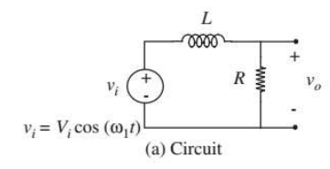
$$
V_o=\frac{R}{R+Ls}V_i
$$

$$
H(jw)=\frac{V_o}{V_i}=\frac{R}{R+sL}
$$

$$
when\space W_0=\frac{R}{L}=\frac{1}{\tau},H=\frac{1}{\sqrt{2}}
$$

$$
\lg H=\lg\frac{w_0}{\sqrt{w_0^2+w^2}}
$$

$$
when\space w\gg w_0,20\lg H=-20\lg\frac{W}{W_0}
$$

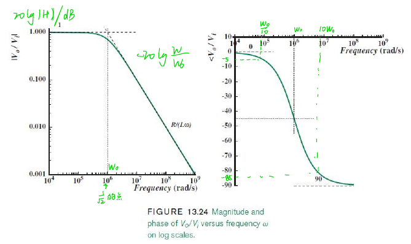

**波特图：**$20\lg|H(jw)|$和$\theta(w)$相对于对数频率坐标的特性曲线。纵坐标用dB作为单位

另：

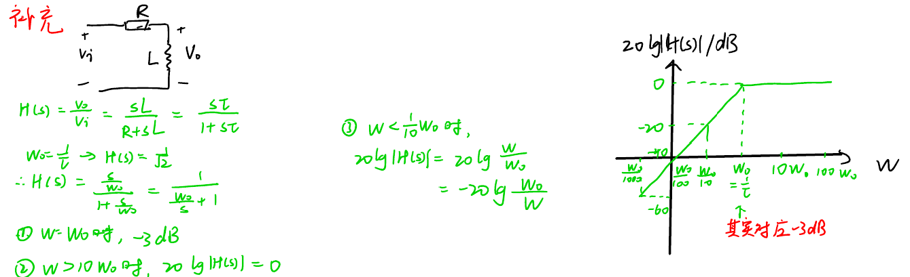

## 一阶RC/RL电路频率响应近似折线图

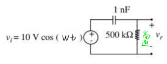

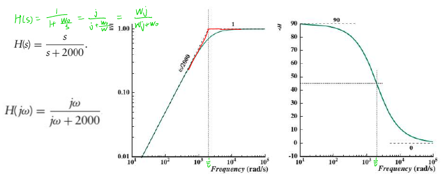

转折频率$w=\frac{1}{RC}$	低频渐近线	高频渐近线	转折频率处相移$45°$

### 滤波器

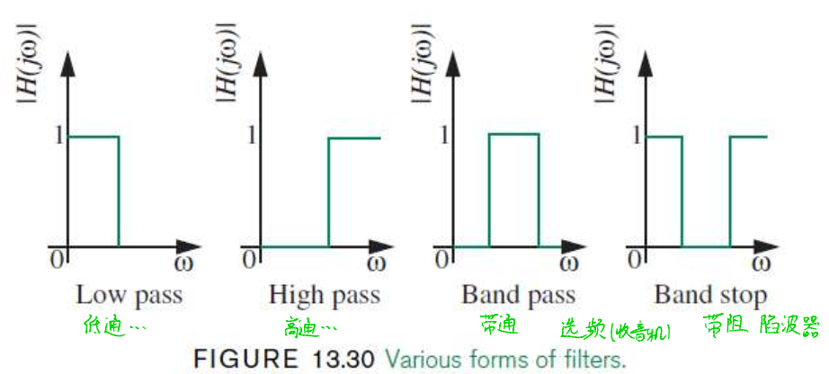

**n阶滤波器：**$w$每上升10倍，下降20dB的n倍

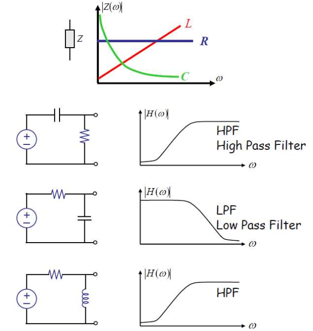

## 放大器级间解耦（待）

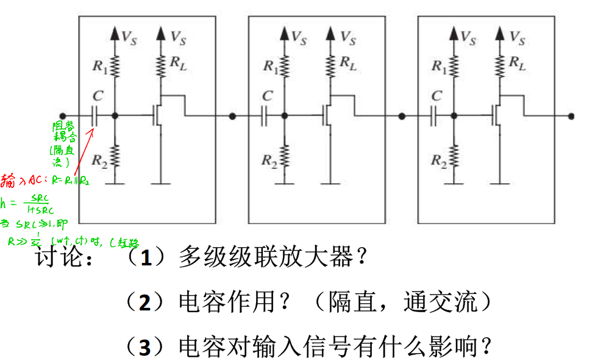

## 补偿电路（待）

## 阻抗中的功率与能量

# 谐振电路

## RLC串联谐振电路

$$
Z(jw)=\frac{\dot{U}}{\dot{I}}=R+j(wL-\frac{1}{wC})=|Z(jw)|\angle\theta(w)
$$

### 谐振条件

$$
w=w_0=\frac{1}{\sqrt{LC}}
$$

$w_0$称为电路**固有谐振角频率**
$$
f=f_0=\frac{1}{2\pi\sqrt{LC}}
$$
RLC串联电路在谐振时感抗和容抗量值上相等，值为谐振电路的**特性阻抗**
$$
\rho =w_0L=\frac{1}{w_0C}=\sqrt{\frac{L}{C}}
$$

### 谐振时电压电流

$$
Z(jw)=R
$$

阻抗呈纯电阻，达最小值

电流达最大值，且与电压源电压同相
$$
Q=\frac{w_0L}{R}=\frac{1}{w_0RC}=\frac{\rho}{R}
$$
Q为串联谐振电路的**品质因素**

各处电压：
$$
\dot{U}_R=\dot{U}_S
$$

$$
\dot{U}_L=jQ\dot{U}_S
$$

$$
\dot{U}_C=-jQ\dot{U}_S
$$

### 谐振时功率能量

由于$u(t)=u_L(t)+u_C(t)=0$（相当于虚短路），任何时刻进入电感电容总瞬时功率为0，电压源发出的功率**全部**被电阻吸收

### 谐振电路的频率特性

串联谐振电路

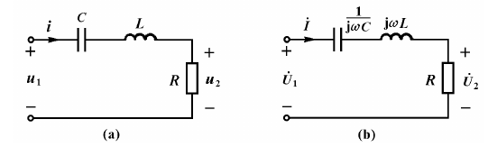
$$
|H(jw)|=\frac{1}{\sqrt{1+Q^2(\frac{w}{w_0}-\frac{w_0}{w})^2}}
$$
当$w=w_0=\frac{1}{\sqrt{LC}}$电路发生谐振，达最大值，电路有**带通滤波特性**

$|H(jw)|=\frac{1}{\sqrt{2}}$，即-3dB时，带宽：$\Delta w=\frac{w_0}{Q}=2\alpha=\frac{1}{\tau}$

故带宽$\Delta w$与品质因素$Q$成反比，通带越窄，曲线越尖锐，对信号选择性越好

**通用谐振曲线**（横纵坐标都是相对量）

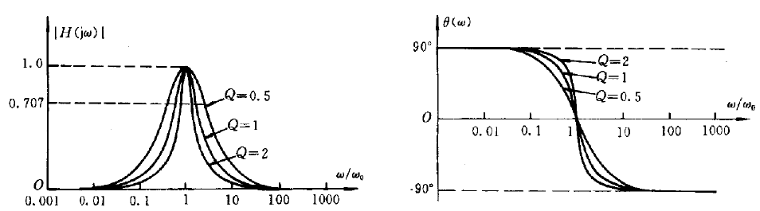

当$w=w_+\space or\space w_-$时，$|H(jw)|=0.707(-3dB),\theta =\pm 45^。$

## RLC并联谐振电路

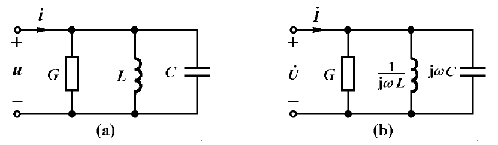

懒得写了，怎么回事呢:shit:

累了😑️，学个模电先
